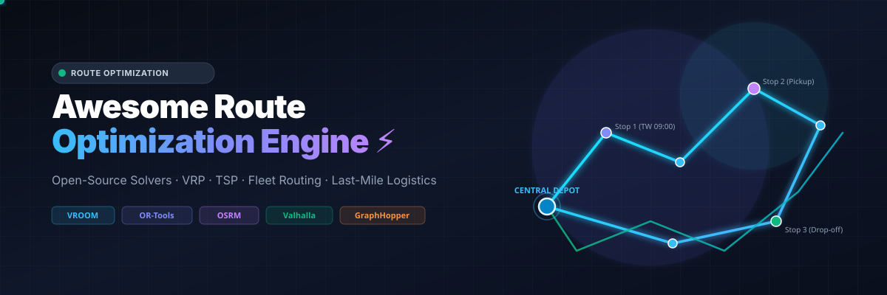
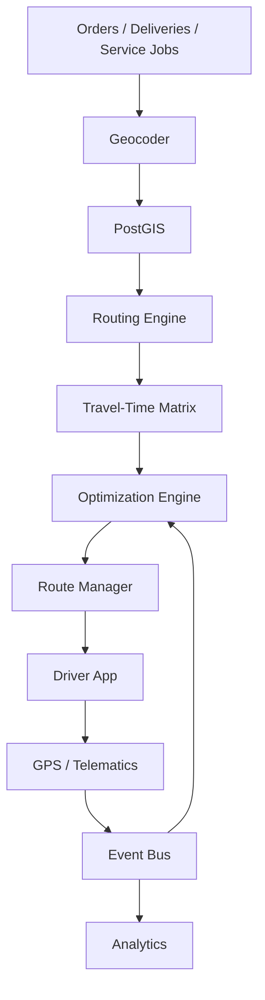
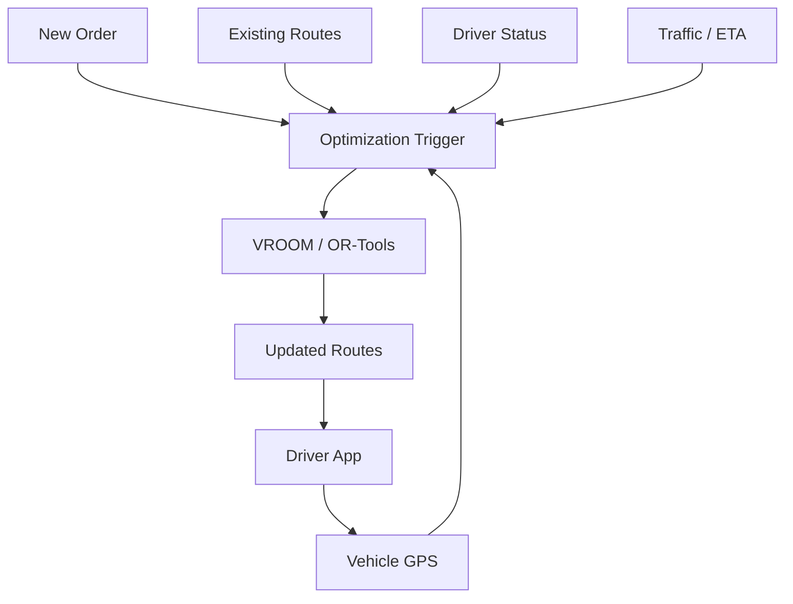
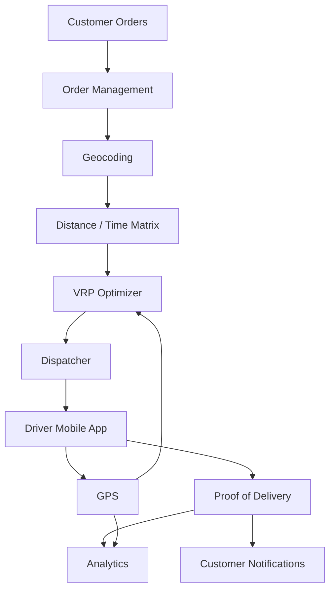
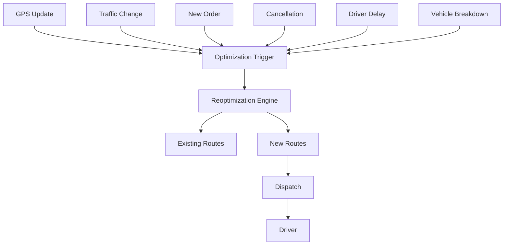

<p align="center">
  
</p>

# 🚀 Awesome Route Optimization Engine

<p align="center">
  <a href="https://github.com/ishandutta2007/Awesome-Awesome-Awesome"></a><a href="https://discord.gg/jc4xtF58Ve"></a>
  <a href="https://github.com/ishandutta2007/Awesome-Route-Optimization-Engine/stargazers"></a>
  <a href="https://github.com/ishandutta2007/Awesome-Route-Optimization-Engine/network/members"></a>
  <a href="https://github.com/ishandutta2007/Awesome-Route-Optimization-Engine/issues"></a>
  <a href="https://github.com/ishandutta2007/Awesome-Route-Optimization-Engine/blob/main/LICENSE"></a>
  <a href="https://github.com/ishandutta2007"></a>
</p>

## 📍 Leading Route Optimization Engines, VRP Solvers, & Fleet Dispatch Architectures

A curated collection, benchmark, and comprehensive engineering guide to **route optimization, vehicle routing problems (VRP, CVRP, VRPTW, PDPTW), fleet dispatching, last-mile delivery algorithms, dynamic re-routing, and production-grade open-source alternatives** to commercial platforms such as **OptimoRoute, Routific, Onfleet, Circuit, FarEye, NextBillion.ai, MyRouteOnline, WorkWave Route Manager, PTV Route Optimiser, and Upper Route Planner**.

> 💡 **Primary Emphasis:** Open-source route optimization engines (Google OR-Tools, VROOM, jsprit, Timefold, PyVRP), road-network routing engines (OSRM, GraphHopper, Valhalla, pgRouting), mapping & spatial indexing stacks (OpenStreetMap, Nominatim, MapLibre, H3, OSMnx), and composable architecture building blocks to design and self-host complete alternatives to proprietary commercial platforms.

---

## 📑 Table of Contents

* [❓ What Is Route Optimization?](#-what-is-route-optimization)
* [💼 SaaS / Hosted Platforms](#-saas--hosted-platforms)
* [🗺️ Open-Source Ecosystem](#-open-source)
  * [🏆 Open-Source Star Leaderboard](#-open-source-star-leaderboard)
  * [⚡ Full Route Optimization Engines](#-full-route-optimization-engines)
  * [🧮 Mathematical Optimization Solvers](#-mathematical-optimization-solvers)
  * [🛣️ Routing / Road-Network Engines](#-routing--road-network-engines)
  * [🌍 Mapping / Geocoding / Matrix](#-mapping--geocoding--matrix)
  * [🚚 Fleet / Dispatch / Delivery Platforms](#-fleet--dispatch--delivery-platforms)
  * [📐 Territory Planning](#-territory-planning)
  * [🔬 Optimization & Data Science Libraries](#-optimization--data-science-libraries)
  * [🔄 Workflow / Event Infrastructure](#-workflow--event-infrastructure)
* [🔄 Commercial → Open-Source Mapping](#-commercial--open-source-mapping)
* [🧩 Route Optimization Problem Types](#-route-optimization-problem-types)
* [🏗️ Core Architecture](#-core-architecture)
* [🏛️ Reference Architectures](#-reference-architecture)
* [📋 Route Optimization Workflow](#-route-optimization-workflow)
* [⚡ Dynamic Dispatch Architecture](#-dynamic-dispatch-architecture)
* [📦 Last-Mile Delivery Architecture](#-last-mile-delivery-architecture)
* [🎯 Sales / Service Territory Optimization](#-sales--service-territory-optimization)
* [📊 Capability Matrix](#-capability-matrix)
* [🏆 Recommended Open-Source Stacks](#-recommended-open-source-stacks)
* [💡 Best Open-Source Choices by Use Case](#-best-open-source-choices-by-use-case)
* [⚖️ What Open Source Can and Cannot Replace](#-what-open-source-can-and-cannot-replace)
* [📦 Route Data Model](#-route-data-model)
* [🎯 Optimization Objective Functions](#-optimization-objective-functions)
* [🔒 Constraints](#-constraints)
* [⏱️ Real-Time Reoptimization](#-real-time-reoptimization)
* [🌐 Geocoding and Travel-Time Data](#-geocoding-and-travel-time-data)
* [🚗 ETA and Traffic](#-eta-and-traffic)
* [🚛 Fleet Management Integration](#-fleet-management-integration)
* [📱 Driver / Mobile Applications](#-driver--mobile-applications)
* [🛡️ Security & Compliance](#-security--compliance)
* [📈 Scalability](#-scalability)
* [📄 Licensing](#-licensing)
* [📚 Open-Source Ecosystem Summary](#-open-source-ecosystem-summary)
* [🥇 Open-Source Shortlist](#-open-source-shortlist)
* [🏁 Conclusion](#-conclusion)
* [📈 Star History](#-star-history)
* [🤝 Contributing](#-contributing)
* [⚠️ Disclaimer](#-disclaimer)

---


# ❓ What Is Route Optimization?


Route optimization is the process of determining the best sequence of stops and assignment of vehicles/drivers while satisfying operational constraints.


Typical objectives include:


* Minimize total distance

* Minimize driving time

* Minimize fuel cost

* Minimize fleet size

* Minimize number of vehicles

* Maximize completed deliveries

* Maximize driver utilization

* Maximize customer SLA compliance

* Minimize overtime

* Minimize late deliveries

* Balance workload across drivers

* Respect vehicle capacity

* Respect delivery time windows

* Respect driver working hours

* Optimize pickup and delivery sequences

* Re-optimize routes dynamically


The underlying problem is generally a form of:


* TSP — Traveling Salesman Problem

* VRP — Vehicle Routing Problem

* CVRP — Capacitated VRP

* VRPTW — Vehicle Routing Problem with Time Windows

* MDVRP — Multi-Depot VRP

* HVRP — Heterogeneous Vehicle Routing Problem

* PDVRP — Pickup and Delivery VRP

* PDPTW — Pickup and Delivery with Time Windows

* DARP — Dial-a-Ride Problem

* DVRP — Dynamic Vehicle Routing Problem

* TDVRP — Time-Dependent Vehicle Routing Problem

* Electric VRP — EVRP

* Split Delivery VRP

* Open VRP

* Periodic VRP

* Multi-trip VRP


A commercial platform normally combines several layers:


```text

                ┌─────────────────────────┐

                │ Orders / Jobs / Stops   │

                └────────────┬────────────┘

                             │

                             ▼

                ┌─────────────────────────┐

                │ Geocoding / Addresses   │

                └────────────┬────────────┘

                             │

                             ▼

                ┌─────────────────────────┐

                │ Travel-Time / Distance  │

                │ Matrix                  │

                └────────────┬────────────┘

                             │

                             ▼

                ┌─────────────────────────┐

                │ Optimization Engine     │

                │ VRP / TSP / Constraints │

                └────────────┬────────────┘

                             │

                             ▼

                ┌─────────────────────────┐

                │ Dispatch / Driver App   │

                └────────────┬────────────┘

                             │

                             ▼

                ┌─────────────────────────┐

                │ GPS / Events / ETA      │

                └────────────┬────────────┘

                             │

                             ▼

                ┌─────────────────────────┐

                │ Re-optimization         │

                └─────────────────────────┘

```


---


# 💼 SaaS / Hosted Platforms


The following are major commercial or hosted platforms in route optimization, delivery management, fleet routing, field service, dispatch, and logistics.


> **Market Overview:** The global route optimization and fleet dispatch software market is estimated at **$5.4B–$6.2B (2024–2025)** and projected to exceed **$12.5B–$15.8B by 2030 (CAGR ~12–14%)**. The sector is **moderately to highly fragmented** rather than winner-take-all: while established public tech and telematics conglomerates (Salesforce, Verizon Connect, Samsara, Descartes) command massive enterprise market share, specialized last-mile routing and algorithmic dispatch remain widely distributed among dozens of innovative mid-market SaaS platforms and emerging open-source stacks.

| Platform | Primary Focus | Typical Strength | Company Size (Valuation / Revenue) | Pricing | Free Tier Limit |
| :--- | :--- | :--- | :--- | :--- | :--- |
| [MapAnything (Salesforce Maps)](https://www.salesforce.com/) | Sales routing | CRM-based mapping | **Market Cap: ~$290B** (NYSE: CRM) · Rev: ~$35B/yr (Salesforce parent) | Starts at $75/user/month (annual; requires Salesforce CRM license from $25/user/month; Advanced tier is $150/user/month) | Free guided product demo; Developer Edition org available for testing; no self-service trial (0 days) and no free-forever plan |
| [Verizon Connect](https://www.verizonconnect.com/) | Fleet management | Fleet + routing + telematics | **Market Cap: ~$175B** (NYSE: VZ) · Fleet division rev: ~$1.2B+/yr | Starts at ~$20–$25/vehicle/month (standard Reveal package; typically 36-month contract) | Free guided live demo; 30-day pilot trial available upon sales qualification; no free-forever plan |
| [Samsara](https://www.samsara.com/) | Fleet operations | Telematics + routing | **Market Cap: ~$22B** (NYSE: IOT) · Rev: ~$1.25B ARR | Starts at ~$27–$33/vehicle/month (telematics & dispatch baseline; $99–$148 upfront hardware per vehicle; 36-month contract) | Free guided product demo; 30-day risk-free hardware return period trial; no free-forever plan |
| [Descartes](https://www.descartes.com/) | Logistics | Enterprise routing | **Market Cap: ~$8.8B** (NASDAQ: DSGX) · Rev: ~$600M+/yr | Starts at ~$99/vehicle/month (or ~$26–$100/user/month OnDemand benchmark; enterprise onboarding from $5,000) | Free customized sales demo with simulated fleet scenarios; no self-service trial (0 days) and no free-forever plan |
| [Geotab](https://www.geotab.com/) | Fleet telematics | Fleet + routing integrations | **Valuation: ~$3.0B+** (Private Unicorn) · Rev: ~$450M–$500M ARR | Starts at ~$15–$25/vehicle/month (GO Core software plan via resellers; hardware ~$150–$250/device) | 30-day pilot / demo unit evaluation via authorized resellers; no free-forever plan |
| [Motive](https://gomotive.com/) | Fleet management | Fleet + dispatch | **Valuation: ~$2.85B** (Series F Unicorn) · Rev: ~$300M+ ARR | Starts at ~$20–$25/vehicle/month (Starter plan; 12-month minimum contract; hardware sold separately) | Free guided product demo; 14-day evaluation unit available upon sales consultation; no free-forever plan |
| [Bringg](https://www.bringg.com/) | Delivery orchestration | Last-mile delivery | **Valuation: ~$1.0B** (Series E Unicorn) · Rev: ~$45M–$60M ARR | Starts at ~$10,000/year (~$833/month base contract benchmark; average enterprise contract ~$20,000/year) | Free custom sales demo; 14-to-30 day pilot evaluation for qualified enterprise accounts; no free-forever plan |
| [Omnitracs](https://www.omnitracs.com/) | Fleet management | Routing and dispatch | **Valuation: ~$800M+** (Acquired by Solera) · Rev: ~$180M–$200M/yr | Starts at ~$30–$40/vehicle/month (telematics/dispatch tier; Roadnet Transportation Suite benchmark starts at $500/month) | Free custom product demo; 14-to-30 day fleet pilot upon sales agreement; no free-forever plan |
| [FarEye](https://fareye.com/) | Logistics orchestration | Enterprise logistics | **Valuation: ~$400M–$500M** (Series E) · Rev: ~$35M–$45M ARR | Enterprise contracts start at ~$10,000/year (~$833/month base platform fee benchmark; Capterra listed baseline $100,000 enterprise deployment) | Free guided live demo; 14-to-30 day scoped pilot/POC trial for qualified enterprise prospects; no free-forever plan |
| [PTV Logistics](https://www.ptvlogistics.com/) | Transport planning | Fleet optimization | **Valuation: ~€300M–€400M** (~$350M–$450M) · Rev: ~€100M+ ARR | Starts at €99/month (or pay-per-transaction from €0.015/calculation beyond free allowance) | Free-forever developer tier with 100,000 transactions/month (OptiFlow API capped at 20 orders/locations, 5 vehicles, 5 min runtime/request; no credit card required) |
| [PTV Route Optimiser](https://www.ptvlogistics.com/) | Fleet optimization | Enterprise logistics | **Valuation: ~€300M–€400M** (~$350M–$450M, PTV Group) · Rev: ~€100M+ ARR | Starts at ~€500–€1,000/month (~€6,000/year minimum software subscription contract benchmark) | Free custom product demo with company fleet routing data; 14-day guided proof-of-concept pilot upon request; no free-forever plan |
| [DispatchTrack](https://www.dispatchtrack.com/) | Delivery management | Routing + visibility | **Valuation: ~$300M–$500M** (Spectrum Equity) · Rev: ~$40M–$60M ARR | Starts at ~$75/truck/month (base deployments starting at ~$500/month depending on fleet size) | Free customized live demo; 14-day sandbox pilot upon sales qualification; no free-forever plan |
| [WorkWave Route Manager](https://www.workwave.com/route-manager/) | Field service | Routing + workforce management | **Valuation: ~$300M+** (Acquired by EQT) · Rev: ~$100M+ ARR (suite) | Starts at $54/vehicle/month (requires a 4-vehicle minimum = $216/month minimum) | Free guided live demo with sample fleet data; no self-service trial (0 days) and no free-forever plan |
| [Locus](https://locus.sh/) | Logistics optimization | Enterprise last mile | **Valuation: ~$300M** (Series C) · Rev: ~$18M–$25M ARR | Starts at ~$49/driver/month (or pilot deployments from ~$1,000/month; enterprise quotes scaled by delivery volume) | Free custom demo; 14-to-30 day guided sandbox / POC pilot; no free-forever plan |
| [ORTEC](https://ortec.com/) | Optimization | Advanced logistics optimization | **Valuation: ~$200M–$300M** · Rev: ~$75M–$100M/yr | Starts at ~$500/month (base module entry benchmark for ORTEC Routing & Dispatch; enterprise deployments scale to $5,000–$50,000+/month) | 30-day proof-of-concept pilot evaluation upon sales qualification; no free-forever plan |
| [Shipsy](https://shipsy.io/) | Logistics | Last-mile and fleet | **Valuation: ~$100M–$150M** (Series B) · Rev: ~$12M–$20M ARR | Starts at ~$10,000/year (~$833/month base contract benchmark; standard mid-market rollouts ~$1,200–$2,500/month) | Free customized interactive demo; 14-to-30 day pilot sandbox upon sales qualification; no free-forever plan |
| [Onfleet](https://onfleet.com/) | Last-mile delivery | Dispatch + driver tracking | **Valuation: ~$100M–$150M** (Series B) · Rev: ~$15M–$20M ARR | Starts at $500/month (annual) or $619/month (monthly) for Launch plan (includes up to 2,500 pickup/delivery tasks/month, unlimited drivers/users) | 14-day free trial (up to 2,500 delivery tasks with full platform access); no free-forever plan |
| [Route4Me](https://route4me.com/) | Route optimization | Large-scale routing | **Valuation: ~$75M–$120M** (Profitable bootstrap) · Rev: ~$15M–$25M ARR | Starts at $199/month (Route Optimization plan, includes 10 team members; solo mobile app starts at $9.99/month) | 7-day free trial with full platform features; mobile app free-forever plan allows up to 10 stops per route (routes expire after 7 days) |
| [NextBillion.ai](https://nextbillion.ai/) | Mapping + optimization | Developer APIs and logistics | **Valuation: ~$60M–$90M** (Series A) · Rev: ~$6M–$10M ARR | Starts at $499/month (Grow plan, includes up to 5,000 orders/month; $0.08 per extra order; 12-month contract) | 14-day free trial (full API/SDK testing access, no credit card required); permanent free access to web utilities (Distance Matrix Calculator, GeoJSON Editor) |
| [SalesRabbit](https://salesrabbit.com/) | Field sales | Territory planning | **Valuation: ~$50M–$80M** · Rev: ~$10M–$15M ARR | Free Lite plan; Team/Pro plans start at $49/user/month (annual) or $59/user/month (monthly) | Free Lite plan forever (limited to 1 user with core mapping & route tracking); no time-limited trial for paid plans |
| [Upper Route Planner](https://www.upperinc.com/) | Route planning | Delivery route optimization | **Valuation: ~$40M–$60M** · Rev: ~$5M–$10M ARR | Starts at $40/user/month (annual) or $48–$50/user/month (monthly) for Starter plan (up to 250 stops/route) | 7-day free trial (up to 3 drivers with full feature access); permanent free web routing tool up to 20 stops without signup |
| [Circuit](https://getcircuit.com/) | Route planning | Multi-stop delivery routing | **Valuation: ~$40M–$60M** (Profitable) · Rev: ~$10M–$15M ARR | Individual driver app starts at $20/month; Circuit for Teams (Spoke) starts at $100/month (annual) or $125/month (monthly) for up to 500 stops/month | Free mobile app plan forever up to 10 stops per route; 7-day free trial for Circuit for Teams (up to 500 stops) |
| [OptimoRoute](https://optimoroute.com/) | Route optimization | Delivery and service routing | **Valuation: ~$35M–$50M** (Series A) · Rev: ~$6M–$10M ARR | Starts at $35.10/driver/month (annual) or $39/driver/month (monthly) for Lite plan (capped at 700 orders) | 30-day free trial (up to 250 stops, no credit card required); no free-forever plan |
| [Routific](https://www.routific.com/) | Last-mile routing | SMB delivery optimization | **Valuation: ~$30M–$50M** (Series A) · Rev: ~$5M–$8M ARR | Free for ≤100 orders/month; paid plans start at $150/month flat base fee (Growing plan, up to 1,000 orders/month; $0.15–$0.03 per additional order) | Free-forever plan up to 100 orders/month (includes core routing & driver mobile app, no credit card required); 14-day free trial for paid plans |
| [Tookan](https://tookanapp.com/) | Field service | Dispatch + routing | **Valuation: ~$30M–$50M** (Jungleworks parent) · Rev: ~$8M–$12M ARR | Starts at $99/month (Startup plan, covers up to 700 tasks/month, $0.15/extra task; unlimited drivers) | 14-day free trial (up to 100 tasks, no credit card required); no free-forever plan |
| [Track-POD](https://www.track-pod.com/) | Delivery management | Routing + POD | **Valuation: ~$25M–$45M** (Profitable) · Rev: ~$5M–$8M ARR | Starts at $49/driver/month (annual) or $59/driver/month (monthly) for Advanced plan (or order-based from $285/month for 1,500 orders) | 7-day free trial (up to 1 driver / full feature access, no credit card required); no free-forever plan |
| [Badger Maps](https://www.badgermapping.com/) | Sales routing | Territory + field sales | **Valuation: ~$20M–$35M** (Bootstrapped profitable) · Rev: ~$5M–$8M ARR | Starts at $58/user/month (annual) or $69/user/month (monthly) for Business plan | 14-day free trial (Business plan, full access, no credit card required); no free-forever plan |
| [Zeo Route Planner](https://zeorouteplanner.com/) | Route planning | Multi-stop optimization | **Valuation: ~$15M–$25M** · Rev: ~$4M–$7M ARR | Individual mobile plan starts at $15.99/month; Zeo for Fleets starts at $35–$40/driver/month ($25/driver/month billed annually) | Free mobile plan forever up to 12 routes/month (unlimited stops); 7-day free trial on Fleet plans (no credit card required) |
| [RoadWarrior](https://roadwarrior.app/) | Route planning | Multi-stop driver routing | **Valuation: ~$10M–$20M** (Acquired) · Rev: ~$2M–$5M ARR | RoadWarrior Pro is $14.99/month; RoadWarrior Flex (Teams) starts at $49/month (includes base dispatch + $14.99/driver/month) | Free Basic plan forever up to 8 stops per route and 50 optimized stops/day; 7-day free trial on RoadWarrior Flex |
| [MyRouteOnline](https://www.myrouteonline.com/) | Multi-stop routing | Route planning | **Valuation: ~$5M–$15M** (Bootstrapped) · Rev: ~$1.5M–$3M ARR | Starts at $19/month (includes 50 address credits/month; single-day pass available at $9 for 50 credits) | Free plan forever up to 6 stops per route on mobile app; web free trial up to 10 stops; no credit card required |


---


# 🗺️ Open-Source

Open-source route optimization is best understood as a **modular, layered ecosystem rather than a single monolith**.

The strongest production architectures typically combine:

```text
OpenStreetMap / OSM Data
      │
      ├── OSRM (8.0k★)
      ├── GraphHopper (6.7k★)
      ├── Valhalla (6.2k★)
      ├── openrouteservice (2.0k★)
      └── pgRouting (1.4k★)
             │
             ▼
      Distance / Time Matrix
             │
             ▼
     ┌────────────────────────────────────────────────────────┐
     │ Route Optimization & Constraint Solvers               │
     ├────────────────────────────────────────────────────────┤
     │ • Google OR-Tools (14.0k★) — General CP-SAT & Rich VRP │
     │ • OptaPlanner / Apache KIE (3.5k★) — Java AI Planning  │
     │ • VROOM (1.9k★) — High-Performance C++ VRP Engine      │
     │ • jsprit (1.8k★) — Java Metaheuristic VRP Toolkit      │
     │ • Timefold Solver (1.8k★) — Enterprise Planning Solver │
     │ • PyVRP (0.7k★) — SOTA Hybrid Genetic Search VRP       │
     └─────────────────────────┬──────────────────────────────┘
                               │
                               ▼
                      Dispatch / API Layer
                               │
                               ▼
                  Driver Application & Tracking
                               │
                               ▼
                   GPS / Fleet Telematics (Traccar)
                               │
                               ▼
                   Real-Time Dynamic Re-routing
```

---

## 🏆 Open-Source Star Leaderboard

The following table ranks the leading open-source repositories in route optimization, routing networks, mathematical solving, mapping, and fleet management sorted by GitHub stars (descending):

| Rank | Project | Category | Stars | Primary Language | Description / Focus |
| :---: | :--- | :--- | :--- | :--- | :--- |
| 1 | [n8n](https://github.com/n8n-io/n8n) | Workflow Automation | [](https://github.com/n8n-io/n8n/stargazers) | TypeScript | Fair-code workflow automation for dispatch pipelines |
| 2 | [Apache Kafka](https://github.com/apache/kafka) | Event Streaming | [](https://github.com/apache/kafka/stargazers) | Java / Scala | High-throughput distributed event streaming for GPS and order events |
| 3 | [Node-RED](https://github.com/node-red/node-red) | Event Infrastructure | [](https://github.com/node-red/node-red/stargazers) | JavaScript | Low-code event-driven wiring for telematics and IoT dispatch |
| 4 | [Temporal](https://github.com/temporalio/temporal) | Workflow Orchestration | [](https://github.com/temporalio/temporal/stargazers) | Go | Durable execution platform for long-running dispatch workflows |
| 5 | [LightGBM](https://github.com/microsoft/LightGBM) | Machine Learning | [](https://github.com/microsoft/LightGBM/stargazers) | C++ / Python | Fast gradient boosting framework for ETA prediction and travel time |
| 6 | [NetworkX](https://github.com/networkx/networkx) | Network Analysis | [](https://github.com/networkx/networkx/stargazers) | Python | Comprehensive graph algorithms and network analysis library |
| 7 | [SciPy](https://github.com/scipy/scipy) | Scientific Computing | [](https://github.com/scipy/scipy/stargazers) | Python / C | Fundamental library for scientific computing and optimization |
| 8 | [Google OR-Tools](https://github.com/google/or-tools) | Optimization Engine | [](https://github.com/google/or-tools/stargazers) | C++ / Python / Java | Industry-standard suite for VRP, CVRP, VRPTW, and integer programming |
| 9 | [MapLibre GL](https://github.com/maplibre/maplibre-gl-js) | Mapping & Visualization | [](https://github.com/maplibre/maplibre-gl-js/stargazers) | TypeScript | Open-source vector tile map SDK for web and mobile dispatch maps |
| 10 | [OSRM](https://github.com/Project-OSRM/osrm-backend) | Routing Engine | [](https://github.com/Project-OSRM/osrm-backend/stargazers) | C++ | Ultra-fast C++ routing engine and distance table calculator on OSM |
| 11 | [Traccar](https://github.com/traccar/traccar) | GPS / Fleet Telematics | [](https://github.com/traccar/traccar/stargazers) | Java | Leading open-source GPS tracking system supporting 1500+ device protocols |
| 12 | [GraphHopper](https://github.com/graphhopper/graphhopper) | Routing Engine | [](https://github.com/graphhopper/graphhopper/stargazers) | Java | Fast and memory-efficient routing engine with turn-by-turn directions |
| 13 | [H3](https://github.com/uber/h3) | Spatial Indexing | [](https://github.com/uber/h3/stargazers) | C / Python | Hexagonal hierarchical spatial index for territory optimization & clustering |
| 14 | [CVXPY](https://github.com/cvxpy/cvxpy) | Mathematical Solver | [](https://github.com/cvxpy/cvxpy/stargazers) | Python | Domain-specific modeling language for convex optimization problems |
| 15 | [Valhalla](https://github.com/valhalla/valhalla) | Routing Engine | [](https://github.com/valhalla/valhalla/stargazers) | C++ | Multimodal open-source routing engine with dynamic tile generation |
| 16 | [OSMnx](https://github.com/gboeing/osmnx) | Spatial Analysis | [](https://github.com/gboeing/osmnx/stargazers) | Python | Street network retrieval, modeling, and shortest-path analysis from OSM |
| 17 | [Nominatim](https://github.com/osm-search/Nominatim) | Geocoding | [](https://github.com/osm-search/Nominatim/stargazers) | C++ / PHP | Official OpenStreetMap search and reverse-geocoding engine |
| 18 | [Pelias](https://github.com/pelias/pelias) | Geocoding | [](https://github.com/pelias/pelias/stargazers) | Node.js | Modular, open-source search engine powered by Elasticsearch |
| 19 | [OptaPlanner / KIE](https://github.com/apache/incubator-kie-optaplanner) | Optimization Engine | [](https://github.com/apache/incubator-kie-optaplanner/stargazers) | Java | AI constraint satisfaction solver for complex enterprise vehicle routing |
| 20 | [OpenMapTiles](https://github.com/openmaptiles/openmaptiles) | Vector Tiles | [](https://github.com/openmaptiles/openmaptiles/stargazers) | Shell / Python | Extensible vector tile schema and generator for custom mapping |
| 21 | [Photon](https://github.com/komoot/photon) | Geocoding | [](https://github.com/komoot/photon/stargazers) | Java | Open-source geocoder based on Elasticsearch and OpenStreetMap data |
| 22 | [Pyomo](https://github.com/Pyomo/pyomo) | Mathematical Solver | [](https://github.com/Pyomo/pyomo/stargazers) | Python | Python-based mathematical programming language with solver plugins |
| 23 | [PuLP](https://github.com/coin-or/pulp) | Mathematical Solver | [](https://github.com/coin-or/pulp/stargazers) | Python | Linear programming modeler supporting multiple backend MIP solvers |
| 24 | [JuMP](https://github.com/jump-dev/JuMP.jl) | Mathematical Solver | [](https://github.com/jump-dev/JuMP.jl/stargazers) | Julia | Fast mathematical optimization modeling package for operations research |
| 25 | [openrouteservice](https://github.com/GIScience/openrouteservice) | Routing Engine | [](https://github.com/GIScience/openrouteservice/stargazers) | Java | Spatial routing platform with distance matrix, isochrones & elevation |
| 26 | [OpenRemote](https://github.com/openremote/openremote) | Fleet / IoT Telematics | [](https://github.com/openremote/openremote/stargazers) | Java | Open-source IoT platform for fleet telematics and smart asset automation |
| 27 | [VROOM](https://github.com/VROOM-Project/vroom) | Optimization Engine | [](https://github.com/VROOM-Project/vroom/stargazers) | C++ | Ultra-fast vehicle routing optimization engine with instant REST API |
| 28 | [jsprit](https://github.com/graphhopper/jsprit) | Optimization Engine | [](https://github.com/graphhopper/jsprit/stargazers) | Java | Rich Java vehicle routing toolkit with customizable metaheuristics |
| 29 | [HiGHS](https://github.com/ERGO-Code/HiGHS) | Mathematical Solver | [](https://github.com/ERGO-Code/HiGHS/stargazers) | C++ | High-performance open-source linear and mixed-integer programming solver |
| 30 | [Timefold Solver](https://github.com/TimefoldAI/timefold-solver) | Optimization Engine | [](https://github.com/TimefoldAI/timefold-solver/stargazers) | Java / Python | Modern AI optimization engine for fleet scheduling, VRP, and workforce |
| 31 | [pgRouting](https://github.com/pgRouting/pgrouting) | Routing Engine | [](https://github.com/pgRouting/pgrouting/stargazers) | C / C++ / SQL | PostGIS extension adding routing, TSP, and VRP algorithms to PostgreSQL |
| 32 | [OwnTracks](https://github.com/owntracks/recorder) | Location Telematics | [](https://github.com/owntracks/recorder/stargazers) | C | Lightweight private GPS location tracking backend and mobile client |
| 33 | [CBC](https://github.com/coin-or/Cbc) | Mathematical Solver | [](https://github.com/coin-or/Cbc/stargazers) | C++ | COIN-OR Branch and Cut mixed integer linear programming solver |
| 34 | [BRouter](https://github.com/abrensch/brouter) | Routing Engine | [](https://github.com/abrensch/brouter/stargazers) | Java | Configurable offline routing engine with elevation and profile awareness |
| 35 | [PyVRP](https://github.com/PyVRP/PyVRP) | Optimization Engine | [](https://github.com/PyVRP/PyVRP/stargazers) | Python / C++ | Award-winning hybrid genetic search VRP library for Python |
| 36 | [MobilityDB](https://github.com/MobilityDB/MobilityDB) | Trajectory Database | [](https://github.com/MobilityDB/MobilityDB/stargazers) | C / SQL | PostgreSQL/PostGIS extension for moving vehicle trajectories and GPS tracks |
| 37 | [RoutingKit](https://github.com/RoutingKit/RoutingKit) | Routing Library | [](https://github.com/RoutingKit/RoutingKit/stargazers) | C++ | C++ routing library for computing shortest paths using contraction hierarchies |
| 38 | [VRPH](https://github.com/coin-or/VRPH) | Optimization Engine | [](https://github.com/coin-or/VRPH/stargazers) | C++ | COIN-OR library of heuristics for generating solutions to the CVRP |
| 39 | [OscaR](https://github.com/oscarlib/oscar) | Optimization Engine | [](https://github.com/oscarlib/oscar/stargazers) | Scala | Scala library for constraint programming and combinatorial optimization |
| 40 | [Open-VRP](https://github.com/roeierez/open-vrp) | Optimization Research | [](https://github.com/roeierez/open-vrp/stargazers) | Java | Experimental vehicle routing problem solver and heuristics benchmark |

---

# ⚡ Full Route Optimization Engines

The following core engines provide the algorithmic solving logic for multi-vehicle routing, pickup-and-delivery, capacity constraints, time windows, and fleet dispatching.

---

## 1. Google OR-Tools [](https://github.com/google/or-tools/stargazers)

**Google Optimization Tools (OR-Tools)**
* **GitHub:** https://github.com/google/or-tools
* **Website:** https://developers.google.com/optimization
* **License:** Apache-2.0
* **Primary Language:** C++ (with Python, Java, and C# bindings)

OR-Tools is the most widely adopted open-source mathematical optimization library in the world for building custom vehicle routing engines. Its routing library provides industrial-strength constraint programming and local search heuristics.

### Key Capabilities:
* Capacitated Vehicle Routing (CVRP) and Multi-Depot VRP (MDVRP)
* Vehicle Routing Problem with Time Windows (VRPTW)
* Pickup and Delivery with Time Windows (PDPTW)
* Heterogeneous fleets, driver break scheduling, and custom routing dimensions
* Penalty-based stop skipping (soft constraints and unperformed stops)
* Solves both pure routing and combined packing/routing (e.g. 3D load placement)

---

## 2. OptaPlanner / Apache KIE Ecosystem [](https://github.com/apache/incubator-kie-optaplanner/stargazers)

**Enterprise Business Resource Planner & Constraint Solver**
* **GitHub:** https://github.com/apache/incubator-kie-optaplanner
* **Website:** https://www.optaplanner.org/
* **License:** Apache-2.0
* **Primary Language:** Java

OptaPlanner is an enterprise AI constraint solver that optimizes business resource planning use cases such as the Vehicle Routing Problem (VRP), employee rostering, and task assignment using metaheuristics (Tabu Search, Simulated Annealing, Late Acceptance).

### Key Capabilities:
* Complex domain modeling with rich business logic written directly in standard Java or Python
* Real-time continuous planning and dynamic route adjustments as new orders arrive
* Hard, medium, and soft score constraints for multi-objective optimization
* Native integration with Quarkus, Spring Boot, and enterprise microservice architectures

---

## 3. VROOM [](https://github.com/VROOM-Project/vroom/stargazers)

**Vehicle Routing Open-source Optimization Machine**
* **GitHub:** https://github.com/VROOM-Project/vroom
* **Website:** https://vroom-project.org/
* **License:** BSD-2-Clause
* **Primary Language:** C++

VROOM is one of the fastest direct open-source alternatives to commercial SaaS route optimization engines. It delivers production-grade vehicle routing solutions in milliseconds and integrates directly with OSRM, Valhalla, and OpenRouteService.

### Key Capabilities:
* TSP, CVRP, VRPTW, Multi-depot VRP, and Heterogeneous fleets
* Pickup and delivery with precedence constraints
* Driver skills, priorities, breaks, and working hours
* Multi-dimensional vehicle capacity (weight, volume, pallet counts)
* Turnkey HTTP REST API wrapper (`vroom-express`) for instant microservice deployment

---

## 4. jsprit [](https://github.com/graphhopper/jsprit/stargazers)

**Java-based Toolkit for Rich Vehicle Routing Problems**
* **GitHub:** https://github.com/graphhopper/jsprit
* **Website:** https://jsprit.github.io/
* **License:** Apache-2.0
* **Primary Language:** Java

Maintained under the GraphHopper organization, jsprit is a lightweight, flexible, and robust Java toolkit for solving rich combinatorial vehicle routing problems using metaheuristic search.

### Key Capabilities:
* Capacitated VRP, Multi-Depot VRP, and Time Windows
* Infinite and finite fleet sizing with heterogeneous vehicle costs
* Flexible custom objective functions and state-dependent constraints
* Native compatibility with GraphHopper routing and matrix APIs

---

## 5. Timefold Solver [](https://github.com/TimefoldAI/timefold-solver/stargazers)

**Modern Open-Source AI Solver for Vehicle Routing & Scheduling**
* **GitHub:** https://github.com/TimefoldAI/timefold-solver
* **Website:** https://timefold.ai/
* **License:** Apache-2.0
* **Primary Language:** Java / Python

Timefold Solver is the modern fork and evolution of OptaPlanner, actively maintained with substantial performance enhancements, enterprise support, and a Python SDK for operations research teams.

### Key Capabilities:
* High-performance constraint streams using incremental calculation
* Solves complex vehicle routing with technician skills, appointment time windows, and multi-day scheduling
* Dynamic re-routing and non-disruptive schedule changes during active driver shifts
* Native integration with modern cloud-native frameworks (Spring Boot 3, Quarkus)

---

## 6. PyVRP [](https://github.com/PyVRP/PyVRP/stargazers)

**State-of-the-Art Vehicle Routing Problem Solver in Python**
* **GitHub:** https://github.com/PyVRP/PyVRP
* **Website:** https://pyvrp.org/
* **License:** MIT
* **Primary Language:** Python / C++

PyVRP is an award-winning open-source package implementing Hybrid Genetic Search (HGS) for a wide range of vehicle routing problem variants. It combines Python ease-of-use with a high-speed C++ algorithmic core.

### Key Capabilities:
* State-of-the-art solution quality on benchmark CVRP and VRPTW instances
* Supports heterogeneous fleets, multiple depots, pickup and deliveries, and duration limits
* Designed specifically for data science workflows and operations research researchers

---

## 7. VRPH [](https://github.com/coin-or/VRPH/stargazers)

**Open-Source Heuristics Library for the Capacitated VRP**
* **GitHub:** https://github.com/coin-or/VRPH
* **Website:** https://www.coin-or.org/
* **License:** EPL-2.0
* **Primary Language:** C++

Part of the COIN-OR initiative, VRPH provides classic, fast local search heuristics and metaheuristics for generating and improving solutions to large-scale CVRP instances.

### Key Capabilities:
* High-speed construction heuristics (Clarke-Wright savings, sweep algorithms)
* Extensive local search moves (2-opt, Or-opt, cross-exchange, 3-opt)
* Extremely fast execution suitable for embedded C++ routing services

---

## 8. OscaR [](https://github.com/oscarlib/oscar/stargazers)

**Scala Optimization & Constraint Programming Toolkit**
* **GitHub:** https://github.com/oscarlib/oscar
* **Website:** https://bitbucket.org/oscarlib/oscar/
* **License:** LGPL-2.1
* **Primary Language:** Scala

OscaR is a versatile Scala toolkit for constraint programming, combinatorial optimization, and vehicle routing.

### Key Capabilities:
* Rich constraint programming framework for custom business rules
* Routing module tailored for rich routing with arbitrary side constraints
* Great for academic research and rule-intensive scheduling systems

---

## 9. Open-VRP [](https://github.com/roeierez/open-vrp/stargazers)

**Experimental Vehicle Routing Heuristics & Frameworks**
* **GitHub:** https://github.com/roeierez/open-vrp
* **License:** Open Source
* **Primary Language:** Java

Academic and experimental frameworks for implementing custom VRP metaheuristics. For enterprise production, OR-Tools, VROOM, Timefold, and jsprit are the recommended industry backends.

---


# 🧮 Mathematical Optimization Solvers

These mathematical libraries and solvers are not turnkey delivery products, but they form the algorithmic foundation of custom route optimizers, column-generation frameworks, and exact MIP solvers.

The following solvers and modeling languages are ranked by GitHub star count (descending):

| Project | Stars | Primary Role | Supported Languages | License |
| :--- | :---: | :--- | :--- | :--- |
| [OR-Tools](https://github.com/google/or-tools) | [](https://github.com/google/or-tools/stargazers) | CP-SAT solver, VRP engine, and linear/integer programming | C++, Python, Java, C# | Apache-2.0 |
| [CVXPY](https://github.com/cvxpy/cvxpy) | [](https://github.com/cvxpy/cvxpy/stargazers) | Domain-specific modeling language for convex optimization | Python | Apache-2.0 |
| [OptaPlanner](https://github.com/apache/incubator-kie-optaplanner) | [](https://github.com/apache/incubator-kie-optaplanner/stargazers) | Enterprise AI constraint satisfaction & business resource planning | Java | Apache-2.0 |
| [Pyomo](https://github.com/Pyomo/pyomo) | [](https://github.com/Pyomo/pyomo/stargazers) | Robust Python-based mathematical programming modeling language | Python | BSD-3-Clause |
| [PuLP](https://github.com/coin-or/pulp) | [](https://github.com/coin-or/pulp/stargazers) | Simple, intuitive linear programming modeler with solver plug-ins | Python | MIT |
| [JuMP](https://github.com/jump-dev/JuMP.jl) | [](https://github.com/jump-dev/JuMP.jl/stargazers) | Ultra-fast modeling language for mathematical optimization in Julia | Julia | MPL-2.0 |
| [VROOM](https://github.com/VROOM-Project/vroom) | [](https://github.com/VROOM-Project/vroom/stargazers) | Ultra-fast heuristic solver for CVRP, VRPTW, and PDPTW | C++ | BSD-2-Clause |
| [jsprit](https://github.com/graphhopper/jsprit) | [](https://github.com/graphhopper/jsprit/stargazers) | Rich Java-based vehicle routing toolkit using Ruin-and-Recreate | Java | Apache-2.0 |
| [HiGHS](https://github.com/ERGO-Code/HiGHS) | [](https://github.com/ERGO-Code/HiGHS/stargazers) | High-performance open-source linear and mixed-integer solver | C++ | MIT |
| [Timefold](https://github.com/TimefoldAI/timefold-solver) | [](https://github.com/TimefoldAI/timefold-solver/stargazers) | Modern AI optimization engine for fleet scheduling & VRP | Java, Python | Apache-2.0 |
| [SCIP](https://github.com/scipopt/scip) | [](https://github.com/scipopt/scip/stargazers) | Leading non-commercial/academic MIP and branch-cut-and-price framework | C, C++ | Apache-2.0 |
| [CBC](https://github.com/coin-or/Cbc) | [](https://github.com/coin-or/Cbc/stargazers) | COIN-OR branch-and-cut solver for mixed integer programs | C++ | EPL-2.0 |
| [PyVRP](https://github.com/PyVRP/PyVRP) | [](https://github.com/PyVRP/PyVRP/stargazers) | Award-winning Hybrid Genetic Search solver for rich VRP | Python, C++ | MIT |
| [VRPH](https://github.com/coin-or/VRPH) | [](https://github.com/coin-or/VRPH/stargazers) | Library of local search heuristics for the Capacitated VRP | C++ | EPL-2.0 |
| [OscaR](https://github.com/oscarlib/oscar) | [](https://github.com/oscarlib/oscar/stargazers) | Constraint programming toolkit with specialized routing extension | Scala | LGPL-2.1 |

---


# 🛣️ Routing / Road-Network Engines

An optimization engine determines **which vehicle should visit which stops and in what order**.
A routing engine determines **how to travel between two points** across the actual road network (turn-by-turn geometry, transit times, and distance matrices).

The leading open-source routing engines are ranked below by GitHub star count (descending):

---

## 1. OSRM [](https://github.com/Project-OSRM/osrm-backend/stargazers)

**Open Source Routing Machine**
* **GitHub:** https://github.com/Project-OSRM/osrm-backend
* **Website:** https://project-osrm.org/
* **License:** BSD-2-Clause
* **Primary Language:** C++

OSRM is an ultra-high-performance routing engine designed for OpenStreetMap data. By pre-processing road networks using Contraction Hierarchies (CH) or Multi-Level Dijkstra (MLD), OSRM computes shortest paths and distance matrices across continental road networks in microseconds.

### Capabilities:
* Point-to-point routing and step-by-step navigation instructions
* High-speed `table` service for N×N distance and travel-time matrices
* Map matching (snapping raw GPS traces to road centerlines)
* Nearest-neighbor snapping and trip optimization (TSP approximation)
* Native matrix supplier for VROOM and custom dispatch workers

---

## 2. GraphHopper [](https://github.com/graphhopper/graphhopper/stargazers)

**Fast and Memory-Efficient Java Routing Engine**
* **GitHub:** https://github.com/graphhopper/graphhopper
* **Website:** https://www.graphhopper.com/
* **License:** Apache-2.0
* **Primary Language:** Java

GraphHopper is a flexible, memory-efficient routing engine written in Java that powers millions of routes daily on OpenStreetMap data.

### Capabilities:
* Fast Contraction Hierarchies and customizable edge-based routing profiles (car, truck, bike, foot)
* High-throughput matrix calculation for logistics and fleet dispatch
* Turn-by-turn voice navigation instructions and alternative route generation
* Map matching engine for post-processing driver telematics tracks
* Seamless synergy with jsprit for vehicle routing optimization

---

## 3. Valhalla [](https://github.com/valhalla/valhalla/stargazers)

**Multimodal Routing Engine with Dynamic Tile Hierarchy**
* **GitHub:** https://github.com/valhalla/valhalla
* **Website:** https://valhalla.github.io/valhalla/
* **License:** MIT
* **Primary Language:** C++

Originally created by Mapzen, Valhalla is a modern, modular C++ routing engine built on a tiled data structure that allows global coverage without requiring massive monolithic memory allocations.

### Capabilities:
* Truly multimodal routing (auto, truck with bridge/weight constraints, pedestrian, transit)
* Time-dependent routing and dynamic traffic penalty overlays
* Isochrone and reachability matrix generation
* Advanced Meili map matching for noisy telematics data
* First-class integration with VROOM for capacitated fleet routing

---

## 4. openrouteservice (ORS) [](https://github.com/GIScience/openrouteservice/stargazers)

**Spatial Routing Services Stack from Heidelberg University**
* **GitHub:** https://github.com/GIScience/openrouteservice
* **Website:** https://openrouteservice.org/
* **License:** Apache-2.0
* **Primary Language:** Java

Developed by the Heidelberg Institute for Geoinformation Technology (HeiGIT), OpenRouteService provides a comprehensive geoprocessing API suite on top of OSM data.

### Capabilities:
* Routing with customizable avoid-features (tollways, ferries, hills, specific areas)
* Time-distance matrix API supporting asynchronous large-scale requests
* Isochrone polygon calculation for service area definition
* Integrated VROOM optimization endpoints
* Elevation profiles and green/quiet routing options

---

## 5. pgRouting [](https://github.com/pgRouting/pgrouting/stargazers)

**Geospatial Routing Inside PostgreSQL / PostGIS**
* **GitHub:** https://github.com/pgRouting/pgrouting
* **Website:** https://pgrouting.org/
* **License:** GPL-2.0
* **Primary Language:** C / C++ / SQL

pgRouting extends PostgreSQL and PostGIS to provide geospatial routing and graph analytics directly inside the database, enabling queries that combine business SQL logic with network algorithms.

### Capabilities:
* Shortest path algorithms: Dijkstra, A*, Bidirectional Dijkstra, Bellman-Ford
* Traveling Salesperson Problem (TSP) and basic VRP solvers
* Driving distance isochrone boundaries
* Dynamic edge cost updates (e.g. real-time road closures or speed changes in SQL)
* Turn restrictions and one-way lane compliance

---

## 6. BRouter [](https://github.com/abrensch/brouter/stargazers)

**Configurable Offline Routing Engine**
* **GitHub:** https://github.com/abrensch/brouter
* **Website:** http://brouter.de/
* **License:** MIT / GPL
* **Primary Language:** Java

BRouter is a lightweight, offline-capable routing engine that emphasizes fine-grained custom profile scripts and elevation awareness.

### Capabilities:
* Expressive profile scripting language for custom vehicle physics and penalties
* Global elevation and slope calculation
* Highly optimized for resource-constrained environments and mobile devices

---

## 7. RoutingKit [](https://github.com/RoutingKit/RoutingKit/stargazers)

**High-Performance C++ Routing Building Blocks**
* **GitHub:** https://github.com/RoutingKit/RoutingKit
* **License:** Custom Permissive (Zlib-like)
* **Primary Language:** C++

RoutingKit is an open-source C++ library that provides basic building blocks for high-performance routing applications, including Contraction Hierarchies and fast graph representations.

### Capabilities:
* Fast graph ingestion and indexing from OpenStreetMap PBF files
* Extremely low-overhead Contraction Hierarchies query engine
* Intended as an embedded component in specialized routing engines

---


# 🌍 Mapping / Geocoding / Matrix

Before an optimization engine can calculate routes, addresses must be geocoded into latitude/longitude coordinates, distance matrices must be computed, and spatial maps must be rendered for dispatchers and drivers.

The leading open-source mapping and geospatial components are ranked below by GitHub star count (descending):

---

## 1. MapLibre GL [](https://github.com/maplibre/maplibre-gl-js/stargazers)

**Open-Source WebGL & Native Vector Map Rendering SDK**
* **GitHub:** https://github.com/maplibre/maplibre-gl-js
* **Website:** https://maplibre.org/
* **License:** BSD-3-Clause
* **Primary Language:** TypeScript / C++

The open-source community fork of Mapbox GL, MapLibre provides GPU-accelerated vector tile rendering for web applications and mobile apps (iOS/Android) without proprietary licensing restrictions.

### Capabilities:
* Hardware-accelerated dynamic vector and raster map rendering
* High-performance real-time marker animations for fleet tracking
* Dynamic route polyline styling, congestion coloring, and animated arrows
* Full offline caching and custom vector style JSON support

---

## 2. H3 [](https://github.com/uber/h3/stargazers)

**Hexagonal Hierarchical Spatial Index**
* **GitHub:** https://github.com/uber/h3
* **Website:** https://h3geo.org/
* **License:** Apache-2.0
* **Primary Language:** C / Python / Java / JavaScript

Created by Uber, H3 is an open-source discrete global grid system that partitions the earth into hexagonal cells across 16 resolution levels.

### Capabilities:
* Ideal for spatial clustering, territory optimization, and customer dispatch zoning
* Invariant neighbor distances (every hexagonal neighbor is equidistant, unlike square grids)
* Fast point-to-cell lookups and hierarchical aggregation for demand heatmaps

---

## 3. OSMnx [](https://github.com/gboeing/osmnx/stargazers)

**Python Spatial Road Network Analysis & Modeling**
* **GitHub:** https://github.com/gboeing/osmnx
* **Website:** https://osmnx.readthedocs.io/
* **License:** MIT
* **Primary Language:** Python

OSMnx allows developers to download, model, analyze, and visualize street networks from OpenStreetMap in Python.

### Capabilities:
* Downloads drivable street networks for any city or bounding box directly into NetworkX graphs
* Computes shortest paths, network centrality, travel speeds, and circuitousness
* Prepares and cleans topological graphs for custom algorithmic experimentation

---

## 4. Nominatim [](https://github.com/osm-search/Nominatim/stargazers)

**Official OpenStreetMap Search and Reverse-Geocoding Engine**
* **GitHub:** https://github.com/osm-search/Nominatim
* **Website:** https://nominatim.org/
* **License:** GPL-2.0
* **Primary Language:** C++ / PHP

Nominatim powers the search bar on OpenStreetMap.org and is the standard self-hosted geocoder for turning delivery addresses into coordinates and vice versa.

### Capabilities:
* Forward geocoding with structured and unstructured queries
* Reverse geocoding of raw driver GPS coordinates to street addresses
* Self-hostable on PostgreSQL/PostGIS for unlimited, cost-free geocoding queries

---

## 5. Pelias [](https://github.com/pelias/pelias/stargazers)

**Modular, Open-Source Geocoder Powered by Elasticsearch**
* **GitHub:** https://github.com/pelias/pelias
* **Website:** https://pelias.io/
* **License:** MIT
* **Primary Language:** Node.js

Originally developed by Mapzen, Pelias is a modular, production-ready geocoding engine built on Elasticsearch.

### Capabilities:
* Autocomplete and instant address search-as-you-type
* Aggregates data from multiple open sources (OSM, OpenAddresses, WhosOnFirst, GeoNames)
* Excellent internationalization and fuzzy address tolerance

---

## 6. OpenMapTiles [](https://github.com/openmaptiles/openmaptiles/stargazers)

**Extensible Vector Tile Generator for Self-Hosted Maps**
* **GitHub:** https://github.com/openmaptiles/openmaptiles
* **Website:** https://openmaptiles.org/
* **License:** CC-BY 4.0 / BSD
* **Primary Language:** Shell / Python / SQL

OpenMapTiles provides an open schema and pipeline to convert raw OSM data into vector tiles that can be served via standard HTTP servers or Docker containers.

### Capabilities:
* Powers custom map styling for dispatch dashboards
* Completely self-hostable with MBTiles or Martin/Tegola tile servers
* Avoids costly recurring tile requests from proprietary mapping providers

---

## 7. Photon [](https://github.com/komoot/photon/stargazers)

**Fast Elasticsearch Geocoder for OpenStreetMap**
* **GitHub:** https://github.com/komoot/photon
* **Website:** https://photon.komoot.io/
* **License:** Apache-2.0
* **Primary Language:** Java

Maintained by Komoot, Photon is an open-source geocoder optimized for rapid search-as-you-type autocomplete.

### Capabilities:
* Multilingual address matching and typo tolerance
* Fast sub-10ms response times for mobile driver address lookups
* Easy self-hosting from pre-built Lucene/Elasticsearch dumps

---

## 8. OpenStreetMap (OSM)

**The Universal Open Geographic Dataset**
* **Website:** https://www.openstreetmap.org/
* **License:** ODbL (Open Database License)

OpenStreetMap is the crowd-sourced geographic dataset that underpins nearly the entire open-source routing and navigation universe. It supplies the road vectors, turn restrictions, speed classifications, bridge clearances, and address numbers used by OSRM, Valhalla, GraphHopper, and Nominatim.

---


# 🚚 Fleet / Dispatch / Delivery Platforms

Route optimization determines the sequence of stops; fleet platforms track execution, capture GPS telemetry, and report real-time status.

The leading open-source fleet and telematics solutions are ranked below by GitHub star count (descending):

---

## 1. Traccar [](https://github.com/traccar/traccar/stargazers)

**Modern Open-Source GPS Fleet Tracking System**
* **GitHub:** https://github.com/traccar/traccar
* **Website:** https://www.traccar.org/
* **License:** Apache-2.0
* **Primary Language:** Java

Traccar is the most popular open-source GPS tracking system in the world. It supports real-time device tracking, geofencing, driver identification, alerts, and comprehensive historical reporting.

### Capabilities:
* Supports over 1,500 GPS hardware communication protocols
* Native mobile client apps (iOS and Android) for driver phone tracking
* Web dashboard with live map tracking, stop detection, and mileage reports
* REST API and webhooks for triggering dynamic re-optimization events on vehicle delays

---

## 2. OpenRemote [](https://github.com/openremote/openremote/stargazers)

**Open-Source IoT & Fleet Automation Platform**
* **GitHub:** https://github.com/openremote/openremote
* **Website:** https://openremote.io/
* **License:** AGPL-3.0
* **Primary Language:** Java / TypeScript

OpenRemote is an enterprise IoT platform designed for smart cities, fleet management, and asset tracking.

### Capabilities:
* Connects telematics devices, sensors, and vehicle OBD-II telemetry
* Rule engine for automated dispatch triggers and geofence-based alerts
* Custom dashboard designer with map tracking and mobile companion applications

---

## 3. OwnTracks [](https://github.com/owntracks/recorder/stargazers)

**Private, Open-Source Location Tracking Engine**
* **GitHub:** https://github.com/owntracks/recorder
* **Website:** https://owntracks.org/
* **License:** GPL-2.0
* **Primary Language:** C

OwnTracks provides open-source mobile clients (iOS/Android) and lightweight backend recorders for secure, private location publishing over MQTT and HTTP.

### Capabilities:
* Ultra-low battery consumption on driver mobile devices
* Encrypted location updates sent directly to your private MQTT broker
* Native geofencing transitions (enter/leave customer zones)

---

## 4. MobilityDB [](https://github.com/MobilityDB/MobilityDB/stargazers)

**Moving Object Database Extension for PostgreSQL / PostGIS**
* **GitHub:** https://github.com/MobilityDB/MobilityDB
* **Website:** https://mobilitydb.com/
* **License:** MPL-2.0
* **Primary Language:** C / SQL

MobilityDB extends PostgreSQL and PostGIS with temporal and spatio-temporal data types to manage, query, and analyze moving object trajectories (fleets, delivery couriers, dynamic assets).

### Capabilities:
* Temporal geometries (`tgeompoint`) for storing continuous vehicle movement
* Spatio-temporal queries: speed at timestamp, proximity between vehicles over time
* Route deviation analysis and planned vs. actual trajectory comparison

---

## 5. OpenGTS

**Legacy Open GPS Tracking System**
* **Website:** http://opengts.sourceforge.net/
* **License:** Apache-2.0
* **Primary Language:** Java

One of the earliest open-source fleet tracking frameworks. For modern production deployments, Traccar and OpenRemote offer vastly superior protocol support, active maintenance, and modern REST APIs.

---


# 📐 Territory Planning

Territory planning partitions a delivery region into balanced, compact zones assigned to specific drivers or depots before day-to-day route sequencing.

The primary open-source tools for territory management include:

* **[H3](https://github.com/uber/h3)** [](https://github.com/uber/h3/stargazers) — Uber's hexagonal spatial index for discrete spatial partitioning, balanced clustering, and compact territory definition.
* **[Open Door Logistics Studio](https://github.com/opendoorlogistics)** — Classic open-source standalone desktop application for territory design, sales territory optimization, and vehicle routing.
* **[OSMnx](https://github.com/gboeing/osmnx)** [](https://github.com/gboeing/osmnx/stargazers) — Road-network topology analysis for calculating street-level travel distances across boundary polygons.

---


# 🔬 Optimization & Data Science Libraries

The following mathematical and scientific data science libraries are widely utilized to build machine-learning ETAs, graph networks, and customized constraint solvers:

| Library | Stars | Primary Focus | Language | License |
| :--- | :---: | :--- | :--- | :--- |
| [LightGBM](https://github.com/microsoft/LightGBM) | [](https://github.com/microsoft/LightGBM/stargazers) | High-speed gradient boosting for travel-time & ETA machine learning models | C++, Python | MIT |
| [NetworkX](https://github.com/networkx/networkx) | [](https://github.com/networkx/networkx/stargazers) | Graph theory algorithms, shortest paths, and network topology analysis | Python | BSD-3-Clause |
| [SciPy](https://github.com/scipy/scipy) | [](https://github.com/scipy/scipy/stargazers) | Scientific computing, sparse matrix handling, and numerical optimization routines | Python, C | BSD-3-Clause |
| [CVXPY](https://github.com/cvxpy/cvxpy) | [](https://github.com/cvxpy/cvxpy/stargazers) | Convex optimization modeling with automatic transformation to backend solvers | Python | Apache-2.0 |
| [OSMnx](https://github.com/gboeing/osmnx) | [](https://github.com/gboeing/osmnx/stargazers) | Python library to retrieve, model, and analyze street networks from OSM | Python | MIT |
| [Pyomo](https://github.com/Pyomo/pyomo) | [](https://github.com/Pyomo/pyomo/stargazers) | Comprehensive optimization modeling language with linear/nonlinear solver integration | Python | BSD-3-Clause |
| [PuLP](https://github.com/coin-or/pulp) | [](https://github.com/coin-or/pulp/stargazers) | Linear programming modeler supporting CBC, GLPK, HiGHS, and commercial solvers | Python | MIT |

---


# 🔄 Workflow / Event Infrastructure

Modern route optimization engines do not run in isolation. They require resilient workflow engines, message queues, and event streams to ingest orders, trigger re-optimizations, and dispatch route updates to driver devices.

The leading open-source workflow and messaging solutions are ranked below by GitHub star count (descending):

---

## 1. n8n [](https://github.com/n8n-io/n8n/stargazers)

**Fair-Code Workflow Automation Platform**
* **GitHub:** https://github.com/n8n-io/n8n
* **Website:** https://n8n.io/
* **License:** Sustainable Use License (Fair-Code)
* **Primary Language:** TypeScript

n8n is an intuitive, extendable workflow automation tool with hundreds of pre-built integrations.

### Best for:
* Ingesting order webhooks from Shopify, WooCommerce, and ERP systems
* Triggering geocoding and route optimization requests automatically
* Sending dispatch notifications to customers via SMS, WhatsApp, and email

---

## 2. Apache Kafka [](https://github.com/apache/kafka/stargazers)

**Distributed Event Streaming Platform**
* **GitHub:** https://github.com/apache/kafka
* **Website:** https://kafka.apache.org/
* **License:** Apache-2.0
* **Primary Language:** Java / Scala

Apache Kafka is the gold standard for high-throughput, fault-tolerant event streaming.

### Best for:
* Ingesting high-frequency real-time GPS pings from hundreds or thousands of active fleet vehicles
* Decoupling telemetry streams from optimization workers
* Event sourcing for route audit trails and proof-of-delivery timelines

---

## 3. Node-RED [](https://github.com/node-red/node-red/stargazers)

**Low-Code Event-Driven Wiring Tool**
* **GitHub:** https://github.com/node-red/node-red
* **Website:** https://nodered.org/
* **License:** Apache-2.0
* **Primary Language:** JavaScript

Node-RED provides a browser-based flow editor that makes it easy to wire together devices, APIs, and online services.

### Best for:
* IoT fleet telematics integration and hardware sensor data ingestion
* Rapid prototyping of delivery status webhooks and SMS alert pipelines

---

## 4. Temporal [](https://github.com/temporalio/temporal/stargazers)

**Durable Execution & Workflow Orchestration Platform**
* **GitHub:** https://github.com/temporalio/temporal
* **Website:** https://temporal.io/
* **License:** MIT
* **Primary Language:** Go

Temporal guarantees that critical, multi-step business workflows execute reliably even in the event of server failures, network partitions, or long delays.

### Best for:
* Managing multi-hour delivery lifecycles (dispatching → driver pickup → transit → POD)
* Asynchronous dispatch worker coordination and optimization retry handling
* Reliable rollback mechanisms when deliveries fail or vehicles breakdown

---


# 🔄 Commercial → Open-Source Mapping


| Commercial Platform        | Closest Open-Source Building Blocks                            |

| -------------------------- | -------------------------------------------------------------- |

| **OptimoRoute**            | VROOM + OSRM/Valhalla + PostGIS + MapLibre                     |

| **Routific**               | VROOM + OSRM + OpenStreetMap + custom dispatch UI              |

| **Onfleet**                | VROOM + Traccar + PostGIS + MapLibre + workflow engine         |

| **Circuit**                | VROOM + OSRM + MapLibre + driver application                   |

| **FarEye**                 | VROOM/OR-Tools + Kafka + PostGIS + Traccar + workflow platform |

| **NextBillion.ai**         | VROOM/OR-Tools + OSRM/Valhalla + OSM + PostGIS                 |

| **MyRouteOnline**          | VROOM + OSRM + Nominatim + MapLibre                            |

| **WorkWave Route Manager** | OR-Tools/jsprit + routing engine + workforce management        |

| **PTV Route Optimiser**    | VROOM/jsprit/OR-Tools + Valhalla/GraphHopper                   |

| **Upper Route Planner**    | VROOM + OSRM + MapLibre                                        |

| **Route4Me**               | VROOM + routing engine + dispatch + mobile application         |

| **Bringg**                 | VROOM + event bus + workflow engine + tracking                 |

| **Locus**                  | OR-Tools/VROOM + ML + routing + dispatch                       |

| **Badger Maps**            | PostGIS + routing engine + territory optimization              |

| **Geotab**                 | Traccar + routing engine + telematics stack                    |


---


# 🧩 Route Optimization Problem Types


## Basic TSP


```text

Depot

  │

  ├── A

  │

  ├── B

  │

  ├── C

  │

  └── D

       │

       ▼

     Depot

```


Goal:


> Visit every location once with minimum total distance.


---


## Capacitated VRP


Each vehicle has limited capacity.


```text

Vehicle Capacity = 1,000 kg


Depot

 ├── Customer A = 300 kg

 ├── Customer B = 250 kg

 ├── Customer C = 200 kg

 └── Customer D = 250 kg

```


---


## VRP with Time Windows


Example:


```text

Customer A → 09:00–10:00

Customer B → 10:30–11:30

Customer C → 13:00–14:00

```


The optimizer must satisfy both:


* routing efficiency

* temporal constraints


---


## Pickup & Delivery


```text

Warehouse

   │

   ▼

Pickup A

   │

   ▼

Delivery A

   │

   ▼

Pickup B

   │

   ▼

Delivery B

```


---


## Heterogeneous Fleet


Different vehicles may have:


* different capacities

* different costs

* different speeds

* different refrigeration capability

* different dimensions

* different driver skills


---


# 🏗️ Core Architecture





---


# 🏛️ Reference Architecture


---


# 📋 Route Optimization Workflow


```mermaid

sequenceDiagram


    participant OMS as Order System

    participant Geo as Geocoder

    participant Matrix as Routing Engine

    participant Opt as Optimizer

    participant Dispatch as Dispatch

    participant Driver as Driver App

    participant GPS as GPS


    OMS->>Geo: Send addresses

    Geo->>OMS: Return coordinates

    OMS->>Matrix: Request travel matrix

    Matrix->>OMS: Return durations/distances

    OMS->>Opt: Submit VRP

    Opt->>Opt: Optimize routes

    Opt->>Dispatch: Publish routes

    Dispatch->>Driver: Send route

    Driver->>GPS: Send location

    GPS->>Dispatch: Vehicle position

    Dispatch->>Opt: Trigger reoptimization

    Opt->>Dispatch: Updated route

```


---


# ⚡ Dynamic Dispatch Architecture





Dynamic optimization can be triggered by:


* New order

* Cancelled order

* Driver absence

* Vehicle breakdown

* Traffic disruption

* Missed delivery

* Customer priority change

* SLA risk

* Driver delay

* Road closure

* Capacity change


---


# 📦 Last-Mile Delivery Architecture





---


# 🎯 Sales / Service Territory Optimization


Route optimization is not limited to parcel delivery.


It can also optimize:


* Sales representatives

* Field engineers

* Medical representatives

* Maintenance technicians

* Inspection teams

* Utility workers

* Healthcare visits

* Home healthcare

* Pest control

* Cleaning services

* Security inspections


---


# 📊 Capability Matrix


| Capability               |  OptimoRoute | Routific | Onfleet | VROOM | OR-Tools | jsprit |  PyVRP |

| ------------------------ | -----------: | -------: | ------: | ----: | -------: | -----: | -----: |

| TSP                      |            ✅ |        ✅ |       ✅ |     ✅ |        ✅ |      ✅ |      ✅ |

| CVRP                     |            ✅ |        ✅ |       ✅ |     ✅ |        ✅ |      ✅ |      ✅ |

| Time Windows             |            ✅ |        ✅ |       ✅ |     ✅ |        ✅ |      ✅ |      ✅ |

| Multi-Depot              |            ✅ |        ✅ |       ✅ |     ✅ |        ✅ |      ✅ |      ✅ |

| Pickup / Delivery        |            ✅ |        ✅ |       ✅ |     ✅ |        ✅ |      ✅ |      ✅ |

| Heterogeneous Fleet      |            ✅ |        ✅ |       ✅ |     ✅ |        ✅ |      ✅ |      ✅ |

| Driver Breaks            |            ✅ |        ✅ |       ✅ |     ✅ |   Custom | Custom | Custom |

| Skills                   |            ✅ |  Limited |       ✅ |     ✅ |   Custom |      ✅ | Custom |

| Custom Constraints       |      Limited |  Limited | Limited |     ✅ |        ✅ |      ✅ |      ✅ |

| Self-Hosted              | ❌/Enterprise |        ❌ |       ❌ |     ✅ |        ✅ |      ✅ |      ✅ |

| Open Source              |            ❌ |        ❌ |       ❌ |     ✅ |        ✅ |      ✅ |      ✅ |

| Custom Algorithms        |      Limited |  Limited | Limited |     ✅ |        ✅ |      ✅ |      ✅ |

| Custom Matrix            |      Limited |  Limited |     API |     ✅ |        ✅ |      ✅ |      ✅ |

| Real-Time Reoptimization |            ✅ |        ✅ |       ✅ |   API |   Custom | Custom | Custom |


---


# 🏆 Recommended Open-Source Stacks


## 1. Best Direct Open-Source Route Optimization Stack


```text

VROOM

+

OSRM

+

OpenStreetMap

+

PostGIS

+

MapLibre

+

FastAPI

+

Redis

```


### Best for


* Last-mile delivery

* Courier companies

* Food delivery

* Distribution

* Field service

* SMB/mid-market fleets


---


# 2. Enterprise Route Optimization Stack


```text

OR-Tools / VROOM

        │

        ▼

Valhalla / GraphHopper / OSRM

        │

        ▼

PostGIS

        │

        ▼

Kafka

        │

        ▼

Temporal

        │

        ▼

Kubernetes

        │

        ▼

Driver Applications

```


Best for:


* Large fleets

* Multi-depot operations

* Enterprise logistics

* Complex constraints

* Dynamic reoptimization


---


# 3. Java Enterprise Stack


```text

Spring Boot

     │

     ▼

jsprit

     │

     ▼

GraphHopper / OSRM / Valhalla

     │

     ▼

PostgreSQL + PostGIS

     │

     ▼

Kafka

     │

     ▼

React / MapLibre

```


Best for organizations with Java expertise.


---


# 4. Python Optimization Stack


```text

FastAPI

   │

   ├── OR-Tools

   ├── PyVRP

   ├── SciPy

   └── NetworkX

          │

          ▼

      PostGIS

          │

          ▼

      OSRM / Valhalla

```


Best for:


* Data science

* AI/ML

* Research

* Custom optimization

* Rapid experimentation


---


# 5. Fully Open-Source Last-Mile Platform


```text

                 ┌──────────────┐

                 │ Order System │

                 └──────┬───────┘

                        │

                        ▼

                 ┌──────────────┐

                 │ PostGIS      │

                 └──────┬───────┘

                        │

             ┌──────────┴─────────┐

             ▼                    ▼

        Nominatim               OSRM

             │                    │

             └──────────┬─────────┘

                        ▼

                   ┌─────────┐

                   │ VROOM   │

                   └────┬────┘

                        │

                        ▼

                   Dispatch API

                        │

              ┌─────────┴────────┐

              ▼                  ▼

        Driver App           Dispatcher

              │

              ▼

            GPS

              │

              ▼

         Reoptimization

```


---


# ⚖️ What Open Source Can and Cannot Replace


## Can replace


Open-source software can reproduce most of the **application and optimization layer** of:


* OptimoRoute

* Routific

* Circuit

* MyRouteOnline

* Upper Route Planner

* Route4Me

* WorkWave Route Manager


It can also provide substantial portions of:


* Onfleet

* FarEye

* Bringg

* NextBillion.ai

* PTV-style optimization systems


---


## Does not automatically replace


The difficult part is not always the optimizer.


Commercial platforms may provide:


* Proprietary traffic data

* Historical traffic models

* Highly optimized ETA models

* Address-quality databases

* Commercial geocoding

* Road restrictions

* Proprietary map data

* Driver behavior models

* Delivery-density models

* Customer intelligence

* Enterprise integrations

* Mobile applications

* Operational support


Therefore:


> **VROOM + OSRM is an optimization stack, not automatically a complete OptimoRoute clone.**


The missing pieces are generally the **data, UX, operational workflows, mobile application, telematics, traffic intelligence and integration layer**.


---


# 📦 Route Data Model


A robust route optimization platform should model at least:


```text

Customer

 ├── id

 ├── name

 ├── address

 ├── latitude

 ├── longitude

 ├── service_duration

 ├── time_windows

 └── priority


Vehicle

 ├── id

 ├── capacity

 ├── vehicle_type

 ├── start_location

 ├── end_location

 ├── working_hours

 ├── skills

 └── cost_profile


Driver

 ├── id

 ├── skills

 ├── working_hours

 └── vehicle_id


Job

 ├── id

 ├── customer_id

 ├── quantity

 ├── service_duration

 ├── priority

 ├── time_window

 └── requirements


Route

 ├── id

 ├── vehicle_id

 ├── driver_id

 ├── ordered_stops

 ├── distance

 ├── duration

 ├── cost

 └── status

```


---


# 🎯 Optimization Objective Functions


A sophisticated optimizer rarely minimizes distance alone.


A weighted objective may look like:


```text

Total Cost =


    α × Distance

  + β × Driving Time

  + γ × Vehicle Cost

  + δ × Overtime

  + ε × Late Deliveries

  + ζ × Unused Capacity

  + η × Number of Vehicles

  + θ × SLA Violations

```


Example:


```text

Minimize:


0.30 × Distance

+ 0.25 × Driving Time

+ 0.15 × Vehicle Cost

+ 0.15 × Overtime

+ 0.10 × Late Deliveries

+ 0.05 × Fleet Size

```


The exact weighting should be determined from business priorities.


---


# 🔒 Constraints


## Vehicle constraints


* Maximum capacity

* Maximum volume

* Maximum weight

* Vehicle dimensions

* Refrigeration

* Hazardous materials

* Vehicle type

* Driver skill

* Vehicle availability


---


## Customer constraints


* Delivery window

* Pickup window

* Service duration

* Priority

* Preferred driver

* Preferred vehicle

* Geographic restrictions


---


## Driver constraints


* Shift start

* Shift end

* Breaks

* Maximum driving hours

* Skills

* Depot assignment


---


## Route constraints


* Maximum route duration

* Maximum distance

* Mandatory stops

* Sequence dependencies

* Pickup-before-delivery

* Precedence

* Route balancing


---


# ⏱️ Real-Time Reoptimization


A commercial-grade system should support:





---


# 🌐 Geocoding and Travel-Time Data


A route optimizer requires high-quality geographic data.


## Open-source stack


```text

OpenStreetMap

      │

      ├── Nominatim

      │

      ├── Photon

      │

      └── Pelias

              │

              ▼

         Coordinates

              │

              ▼

       OSRM / Valhalla

              │

              ▼

        Time Matrix

```


---


# 🚗 ETA and Traffic


Basic routing:


```text

Distance → Static Road Network

```


Commercial ETA:


```text

Distance

+

Road Network

+

Historical Traffic

+

Live Traffic

+

Weather

+

Vehicle Type

+

Time of Day

+

Day of Week

+

Driver Behavior

=

ETA

```


This is one of the biggest differences between a simple open-source routing system and a sophisticated commercial logistics platform.


---


# 🚛 Fleet Management Integration


Useful open-source integrations include:


```text

GPS / Telematics

      │

      ▼

Traccar

      │

      ▼

Kafka / MQTT

      │

      ▼

Fleet Event Service

      │

      ▼

Optimization Engine

```


Possible events:


* Vehicle departed

* Vehicle arrived

* Stop completed

* Stop skipped

* Vehicle delayed

* Driver stopped

* Route deviation

* Vehicle offline

* Vehicle breakdown


---


# 📱 Driver / Mobile Applications


A complete OptimoRoute/Onfleet-style system needs a driver application.


Potential stack:


```text

React Native / Flutter

        │

        ▼

MapLibre

        │

        ▼

Routing API

        │

        ▼

Dispatch API

        │

        ▼

VROOM

```


Driver features:


* Today's route

* Turn-by-turn navigation

* Stop list

* Customer information

* Delivery instructions

* Proof of delivery

* Barcode scanning

* Signature capture

* Photograph

* Customer notification

* Status updates

* Offline mode

* GPS tracking


---


# 🛡️ Security & Compliance


A production deployment should consider:


* TLS

* API authentication

* OAuth2/OIDC

* Role-based access control

* Driver authorization

* Tenant isolation

* Encryption at rest

* Encryption in transit

* Audit logging

* API rate limiting

* Secret management

* Database backups

* GPS privacy

* Data retention

* GDPR

* Local privacy regulations

* Customer data deletion

* Location-data access controls


Useful open-source components:


| Requirement   | Project                                                      |

| ------------- | ------------------------------------------------------------ |

| Identity      | [Keycloak](https://www.keycloak.org/)                        |

| Reverse Proxy | [Traefik](https://traefik.io/) / [NGINX](https://nginx.org/) |

| Secrets       | [OpenBao](https://openbao.org/)                              |

| Database      | [PostgreSQL](https://www.postgresql.org/)                    |

| Geospatial DB | [PostGIS](https://postgis.net/)                              |

| Observability | [Grafana](https://grafana.com/)                              |

| Metrics       | [Prometheus](https://prometheus.io/)                         |

| Logs          | [Loki](https://grafana.com/oss/loki/)                        |


---


# 📈 Scalability


A route optimization system can become computationally expensive because VRP is NP-hard.


A scalable architecture should separate:


```text

API Layer

   │

   ▼

Job Queue

   │

   ▼

Optimization Workers

   │

   ├── Worker 1

   ├── Worker 2

   ├── Worker 3

   └── Worker N

          │

          ▼

      VROOM / OR-Tools

```


---


# ⚙️ Optimization Worker Strategy


```text

Small problem

    │

    └── Synchronous VROOM


Medium problem

    │

    └── Async optimization worker


Large problem

    │

    └── Distributed optimization


Dynamic problem

    │

    └── Incremental / rolling reoptimization

```


---


# 📄 Licensing


| Project            | License / Model                                  |

| ------------------ | ------------------------------------------------ |

| VROOM              | BSD-2-Clause                                     |

| OR-Tools           | Apache-2.0                                       |

| jsprit             | Apache-2.0                                       |

| PyVRP              | Open source                                      |

| VRPH               | Open source                                      |

| OSRM               | BSD-style                                        |

| Valhalla           | MIT                                              |

| GraphHopper OSS    | Apache-2.0                                       |

| OpenRouteService   | Open source                                      |

| OpenStreetMap data | ODbL                                             |

| Nominatim          | GPL                                              |

| Photon             | Apache-2.0                                       |

| Pelias             | MIT                                              |

| PostGIS            | GPL                                              |

| PostgreSQL         | PostgreSQL License                               |

| MapLibre           | BSD-3-Clause                                     |

| Traccar            | Apache-2.0                                       |

| Temporal           | MIT                                              |

| Node-RED           | Apache-2.0                                       |

| Kafka              | Apache-2.0                                       |

| n8n                | Source-available / Sustainable Use License model |

| Keycloak           | Apache-2.0                                       |

| Prometheus         | Apache-2.0                                       |

| Grafana OSS        | AGPL-3.0                                         |


> Always verify the license of the exact version and dependency set used in production. In particular, distinguish **OSI-approved open source**, source-available software, hosted/commercial editions, map-data licenses, and API/data-provider terms.


---


# 🌐 Open-Source Architecture Patterns


## Pattern 1 — Simple Route Optimizer


```text

PostgreSQL

    │

    ▼

OSRM

    │

    ▼

VROOM

    │

    ▼

REST API

    │

    ▼

Web UI

```


---


## Pattern 2 — Enterprise


```text

                 API Gateway

                      │

                ┌─────┴─────┐

                ▼           ▼

             Orders      GPS Events

                │           │

                └─────┬─────┘

                      ▼

                    Kafka

                      │

          ┌───────────┴───────────┐

          ▼                       ▼

     Geocoding               Telemetry

          │                       │

          └───────────┬───────────┘

                      ▼

                   PostGIS

                      │

                      ▼

              Routing / Matrix

                      │

                      ▼

             Optimization Pool

                      │

              ┌───────┴────────┐

              ▼                ▼

            VROOM           OR-Tools

              │                │

              └───────┬────────┘

                      ▼

                   Dispatch

                      │

                      ▼

                  Driver App

```


---


# 📚 Open-Source Ecosystem Summary


| Layer                 | Recommended Projects                |

| --------------------- | ----------------------------------- |

| Road Data             | OpenStreetMap                       |

| Geocoding             | Nominatim / Photon / Pelias         |

| Routing               | OSRM / Valhalla / GraphHopper / ORS |

| Optimization          | VROOM / OR-Tools / jsprit / PyVRP   |

| Advanced Optimization | OptaPlanner / SCIP / HiGHS          |

| Database              | PostgreSQL + PostGIS                |

| Maps                  | MapLibre                            |

| Fleet Tracking        | Traccar                             |

| Workflow              | Temporal / Node-RED                 |

| Event Streaming       | Kafka                               |

| API                   | FastAPI / Spring Boot / Go          |

| Mobile                | Flutter / React Native              |

| Authentication        | Keycloak                            |

| Monitoring            | Prometheus + Grafana                |

| Analytics             | Metabase / Apache Superset          |

| Containerization      | Docker                              |

| Orchestration         | Kubernetes                          |


---


# 💡 Best Open-Source Choices by Use Case


| Use Case                   | Recommended Stack                         |

| -------------------------- | ----------------------------------------- |

| Basic multi-stop routing   | VROOM + OSRM                              |

| Last-mile delivery         | VROOM + OSRM + PostGIS                    |

| Enterprise VRP             | OR-Tools + Valhalla                       |

| Java enterprise            | jsprit + GraphHopper                      |

| Python optimization        | OR-Tools + PyVRP                          |

| Research                   | PyVRP + OR-Tools                          |

| High-performance C++       | VROOM + OSRM                              |

| Dynamic dispatch           | VROOM + Kafka + Temporal                  |

| Fleet tracking             | Traccar + VROOM                           |

| Field service              | jsprit/VROOM + PostGIS + MapLibre         |

| Sales territory            | PostGIS + OR-Tools + MapLibre             |

| Multi-depot distribution   | VROOM + Valhalla                          |

| Pickup & delivery          | VROOM / OR-Tools                          |

| Complex custom constraints | OR-Tools / jsprit                         |

| Open map stack             | OSM + Nominatim + OSRM + MapLibre         |

| Fully self-hosted stack    | OSM + PostGIS + OSRM + VROOM + MapLibre   |

| Mobile delivery            | VROOM + MapLibre + Flutter                |

| AI-enhanced routing        | VROOM/OR-Tools + ML ETA model             |

| Electric vehicle routing   | OR-Tools / custom solver + routing engine |


---


# 🥇 Open-Source Shortlist


## Tier 1 — Most Important


### VROOM


**Best direct open-source route optimization engine**


https://github.com/VROOM-Project/vroom


Why:


* Purpose-built for VRP

* Fast

* C++

* API-friendly

* Multiple constraints

* OSRM/Valhalla/ORS integration

* Excellent for production systems


---


### Google OR-Tools


**Best general-purpose optimization toolkit**


https://github.com/google/or-tools


Why:


* Extremely flexible

* Mature

* Multi-language

* Rich constraint model

* Excellent for custom optimization


---


### jsprit


**Best Java-centric VRP toolkit**


https://github.com/graphhopper/jsprit


Why:


* Rich VRP support

* Java

* Extensible

* Custom constraints

* Strong enterprise integration


---


### OSRM


**Best high-performance routing backend**


https://github.com/Project-OSRM/osrm-backend


---


### Valhalla


**Best flexible open routing engine for advanced routing scenarios**


https://github.com/valhalla/valhalla


---


### GraphHopper


**Best integrated routing + optimization ecosystem**


https://github.com/graphhopper/graphhopper


---


## Tier 2 — Important


* [PyVRP](https://github.com/PyVRP/PyVRP)

* [VRPH](https://github.com/coin-or/VRPH)

* [OptaPlanner](https://www.optaplanner.org/)

* [OscaR](https://github.com/oscarlib/oscar)

* [openrouteservice](https://github.com/GIScience/openrouteservice)

* [Traccar](https://github.com/traccar/traccar)

* [Nominatim](https://github.com/osm-search/Nominatim)

* [Pelias](https://github.com/pelias/pelias)

* [Photon](https://github.com/komoot/photon)

* [PostGIS](https://postgis.net/)

* [MapLibre](https://maplibre.org/)


---


# Why VROOM Is Particularly Interesting


For someone looking to build an open-source alternative to:


* OptimoRoute

* Routific

* Circuit

* MyRouteOnline

* Upper Route Planner


VROOM is arguably the most direct starting point.


Its architecture is conceptually simple:


```text

Jobs

 +

Vehicles

 +

Constraints

 +

Travel Matrix

       │

       ▼

     VROOM

       │

       ▼

Optimized Routes

```


The application layer can then be built around it.


---


# Why OR-Tools Is Particularly Interesting


OR-Tools becomes particularly attractive when the routing problem contains unusual business constraints.


For example:


```text

Vehicle capacity

+

Driver skill

+

Customer priority

+

Time window

+

Pickup before delivery

+

Maximum driving time

+

Vehicle refrigeration

+

Break requirement

+

Route balancing

+

Penalty for SLA violation

```


OR-Tools provides a strong foundation for implementing these custom rules.


---


# Why jsprit Is Particularly Interesting


jsprit is an excellent choice when:


* The organization is Java-centric

* Spring Boot is already used

* Complex constraints are required

* A highly customizable VRP model is needed

* The optimizer needs to be embedded directly into an enterprise application


---


# Why OSRM + VROOM Is a Powerful Combination


```text

OpenStreetMap

      │

      ▼

     OSRM

      │

      ▼

Distance / Duration Matrix

      │

      ▼

    VROOM

      │

      ▼

Optimized Vehicle Routes

```


This combination provides the core computational foundation for a self-hosted route optimization service.


---


# 🏢 Building an Open-Source OptimoRoute Alternative


A practical architecture could be:


```text

                    ┌─────────────────┐

                    │ Customer Portal │

                    └────────┬────────┘

                             │

                    ┌────────▼────────┐

                    │ Order Management│

                    └────────┬────────┘

                             │

                    ┌────────▼────────┐

                    │ PostGIS         │

                    └────────┬────────┘

                             │

               ┌─────────────▼─────────────┐

               │ Geocoding + Matrix Layer  │

               │ Nominatim + OSRM          │

               └─────────────┬─────────────┘

                             │

                    ┌────────▼────────┐

                    │ VROOM           │

                    └────────┬────────┘

                             │

                    ┌────────▼────────┐

                    │ Dispatch Engine │

                    └────────┬────────┘

                             │

                ┌────────────▼────────────┐

                │ Driver Mobile App       │

                └────────────┬────────────┘

                             │

                    ┌────────▼────────┐

                    │ GPS / Traccar   │

                    └────────┬────────┘

                             │

                    ┌────────▼────────┐

                    │ Reoptimization │

                    └─────────────────┘

```


---


# 🏢 Building an Open-Source Onfleet Alternative


A practical stack:


```text

VROOM

+

OSRM / Valhalla

+

PostGIS

+

Traccar

+

MapLibre

+

FastAPI

+

Kafka

+

Temporal

+

Flutter

+

Keycloak

```


This can provide:


* Delivery management

* Driver tracking

* Dispatch

* Route optimization

* Proof of delivery

* GPS tracking

* Dynamic re-routing

* Customer notifications

* Operational analytics


---


# 🏢 Building an Open-Source NextBillion.ai Alternative


NextBillion.ai is broader than a pure VRP optimizer.


An open-source equivalent would therefore be a collection of services:


```text

OpenStreetMap

      │

      ├── Nominatim

      ├── OSRM

      ├── Valhalla

      └── GraphHopper

             │

             ▼

        Routing APIs

             │

             ├── Matrix

             ├── Directions

             ├── Isochrones

             └── Map Matching

                    │

                    ▼

             VROOM / OR-Tools

                    │

                    ▼

             Optimization API

```


This approach gives substantially more control than adopting a single hosted API.


---


# 🏢 Building an Open-Source PTV-Style Optimization System


For complex transport planning:


```text

Orders

  +

Fleet

  +

Depots

  +

Driver Constraints

  +

Vehicle Constraints

  +

Time Windows

  +

Traffic

  +

Costs

      │

      ▼

OR-Tools / jsprit / VROOM

      │

      ▼

Transport Plan

      │

      ▼

Dispatch

      │

      ▼

Execution

      │

      ▼

Actual vs Planned

      │

      ▼

Continuous Optimization

```


---


# 🔍 Route Optimization vs Route Planning


These terms should not be confused.


### Route Planning


Answers:


> How should I travel from A → B → C?


Typical engines:


* OSRM

* Valhalla

* GraphHopper

* OpenRouteService


### Route Optimization


Answers:


> Which vehicle should visit A, B, C, D and E, in what order, while satisfying capacity, time windows and operational constraints?


Typical engines:


* VROOM

* OR-Tools

* jsprit

* PyVRP

* OptaPlanner


Therefore:


```text

Routing Engine ≠ Optimization Engine

```


A sophisticated commercial route platform normally needs **both**.


---


# 🎯 Recommended Starting Point


## If the goal is a direct open-source alternative to OptimoRoute


Start with:


```text

VROOM

+

OSRM

+

OpenStreetMap

+

PostGIS

+

MapLibre

```


---


## If the goal is an Onfleet-style delivery platform


Start with:


```text

VROOM

+

OSRM / Valhalla

+

Traccar

+

PostGIS

+

MapLibre

+

Temporal

+

Kafka

+

Flutter

```


---


## If the goal is a NextBillion.ai-style developer platform


Start with:


```text

OpenStreetMap

+

OSRM

+

Valhalla

+

GraphHopper

+

Nominatim

+

VROOM

+

OR-Tools

+

PostGIS

+

MapLibre

```


---


## If the goal is complex enterprise optimization


Start with:


```text

OR-Tools

+

jsprit

+

Valhalla

+

PostGIS

+

Kafka

+

Temporal

+

Kubernetes

```


---


# 🏁 Conclusion


The open-source route optimization ecosystem is unusually strong.


There is no single open-source project that reproduces every feature of:


* OptimoRoute

* Routific

* Onfleet

* Circuit

* FarEye

* NextBillion.ai

* MyRouteOnline

* WorkWave Route Manager

* PTV Route Optimiser

* Upper Route Planner


However, the underlying technology required to build such a platform is available.


The strongest combination is:


```text

                    OPEN DATA

                       │

                 OpenStreetMap

                       │

                       ▼

             ┌──────────────────┐

             │ Routing Engines  │

             │ OSRM             │

             │ Valhalla         │

             │ GraphHopper      │

             │ OpenRouteService  │

             └────────┬─────────┘

                      │

                      ▼

               Travel Matrix

                      │

                      ▼

             ┌──────────────────┐

             │ Optimization     │

             │ VROOM            │

             │ OR-Tools         │

             │ jsprit           │

             │ PyVRP            │

             └────────┬─────────┘

                      │

                      ▼

             ┌──────────────────┐

             │ Dispatch         │

             │ PostGIS          │

             │ Kafka            │

             │ Temporal         │

             └────────┬─────────┘

                      │

                      ▼

             ┌──────────────────┐

             │ Driver Platform  │

             │ Mobile + GPS     │

             └────────┬─────────┘

                      │

                      ▼

             ┌──────────────────┐

             │ Analytics / AI   │

             └──────────────────┘

```


### Overall open-source recommendation


| Requirement                           | First Choice             |

| ------------------------------------- | ------------------------ |

| **Best direct VRP engine**            | **VROOM**                |

| **Best customizable optimizer**       | **OR-Tools**             |

| **Best Java VRP engine**              | **jsprit**               |

| **Best Python VRP stack**             | **PyVRP + OR-Tools**     |

| **Best routing engine**               | **OSRM**                 |

| **Best flexible routing engine**      | **Valhalla**             |

| **Best integrated routing ecosystem** | **GraphHopper**          |

| **Best open map data**                | **OpenStreetMap**        |

| **Best geospatial database**          | **PostgreSQL + PostGIS** |

| **Best open map UI**                  | **MapLibre**             |

| **Best open fleet tracker**           | **Traccar**              |

| **Best workflow engine**              | **Temporal**             |

| **Best event backbone**               | **Kafka**                |

| **Best authentication**               | **Keycloak**             |


> **Bottom line:** If the primary objective is to create a self-hosted, open-source alternative to **OptimoRoute/Routific/Circuit**, **VROOM + OSRM + OpenStreetMap + PostGIS + MapLibre** is probably the strongest starting architecture. For highly customized enterprise constraints, add **OR-Tools or jsprit** rather than trying to force every requirement into a single optimizer.


---


# 🤝 Contributing


Contributions are welcome.


Useful contributions include:


* Additional open-source VRP engines

* New routing engines

* Benchmark results

* Optimization algorithms

* Open-source dispatch systems

* Driver applications

* Fleet-management integrations

* Geographic datasets

* Traffic-data integrations

* EV-routing implementations

* Multi-depot examples

* Dynamic-routing examples

* Performance benchmarks


---

## 📈 Star History

[](https://star-history.dera.page/#ishandutta2007/Awesome-Route-Optimization-Engine&type=date&legend=top-left)

---


---


# ⚠️ Disclaimer


This README is intended as a technical reference and architecture guide.


Project availability, features, APIs, licenses, hosted offerings and commercial terms can change. Always verify the current project repository, documentation and license before deploying any component in production.


Particular care should be taken with:


* OpenStreetMap/ODbL obligations

* Commercial map-data restrictions

* Geocoding usage policies

* Traffic-data licensing

* Hosted API terms

* Source-available licenses

* Dependency licenses

* Mobile-app SDK terms

* Enterprise redistribution requirements


---


## Recommended Starting Stack


```text

              ┌──────────────────────┐

              │     OpenStreetMap    │

              └──────────┬───────────┘

                         │

                         ▼

              ┌──────────────────────┐

              │ Nominatim / Photon   │

              │     Geocoding        │

              └──────────┬───────────┘

                         │

                         ▼

              ┌──────────────────────┐

              │ OSRM / Valhalla      │

              │ Routing + Matrix     │

              └──────────┬───────────┘

                         │

                         ▼

              ┌──────────────────────┐

              │        VROOM         │

              │   VRP Optimization   │

              └──────────┬───────────┘

                         │

                         ▼

              ┌──────────────────────┐

              │ PostgreSQL + PostGIS │

              └──────────┬───────────┘

                         │

             ┌───────────┴───────────┐

             ▼                       ▼

      ┌──────────────┐       ┌──────────────┐

      │   MapLibre   │       │   Traccar    │

      │ Web / Maps   │       │ GPS / Fleet  │

      └──────┬───────┘       └──────┬───────┘

             │                       │

             └───────────┬───────────┘

                         ▼

                 ┌───────────────┐

                 │   Dispatch    │

                 │ API / Workers │

                 └───────┬───────┘

                         │

                         ▼

                 ┌───────────────┐

                 │ Driver Mobile │

                 │ App           │

                 └───────────────┘

```


**This stack provides the foundation for a genuinely self-hosted, open-source route optimization platform rather than merely a route-planning application.**
