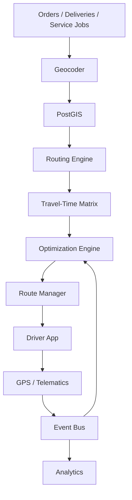
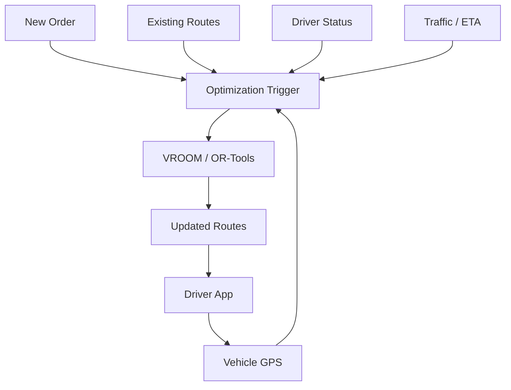
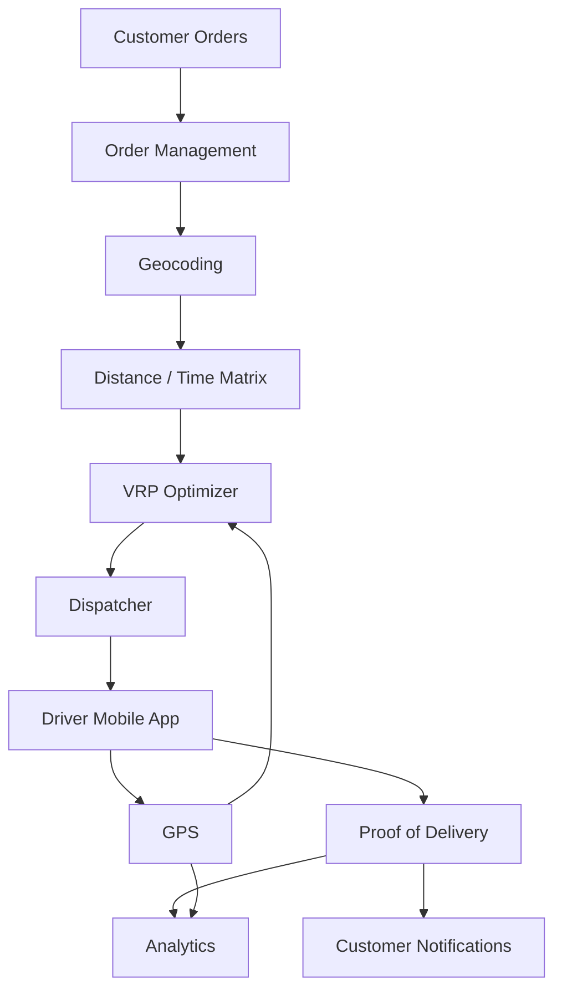
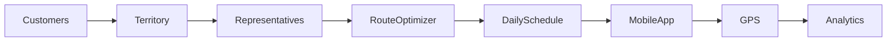
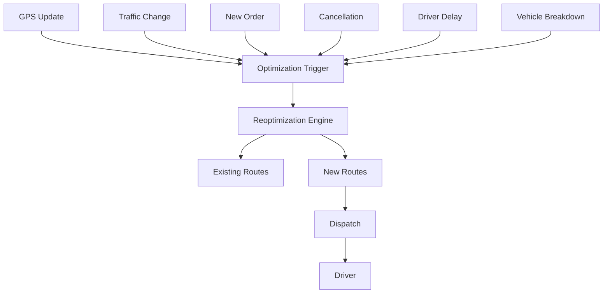

# Awesome-Route-Optimization-Engine

## Top Route Optimization Engines — README.md


A comprehensive guide to **route optimization, vehicle routing, fleet routing, last-mile delivery optimization, dispatch optimization, and open-source alternatives** to leading commercial platforms such as **OptimoRoute, Routific, Onfleet, Circuit, FarEye, NextBillion.ai, MyRouteOnline, WorkWave Route Manager, PTV Route Optimiser, and Upper Route Planner**.


> **Primary emphasis:** Open-source route optimization engines, solvers, routing engines, mapping stacks, and composable building blocks that can be self-hosted and integrated into a complete alternative to commercial route-planning platforms.


---


## Table of Contents


* [What Is Route Optimization?](#what-is-route-optimization)

* [SaaS / Hosted Platforms](#saas--hosted-platforms)

* [Open-Source](#open-source)


  * [Full Route Optimization Engines](#full-route-optimization-engines)

  * [Mathematical Optimization Solvers](#mathematical-optimization-solvers)

  * [Routing / Road-Network Engines](#routing--road-network-engines)

  * [Mapping / Geocoding / Matrix](#mapping--geocoding--matrix)

  * [Fleet / Dispatch / Delivery Platforms](#fleet--dispatch--delivery-platforms)

  * [Territory Planning](#territory-planning)

  * [Optimization & Data Science Libraries](#optimization--data-science-libraries)

  * [Workflow / Event Infrastructure](#workflow--event-infrastructure)

* [Commercial → Open-Source Mapping](#commercial--open-source-mapping)

* [Route Optimization Problem Types](#route-optimization-problem-types)

* [Core Architecture](#core-architecture)

* [Reference Architectures](#reference-architectures)

* [Route Optimization Workflow](#route-optimization-workflow)

* [Dynamic Dispatch Architecture](#dynamic-dispatch-architecture)

* [Last-Mile Delivery Architecture](#last-mile-delivery-architecture)

* [Sales / Service Territory Optimization](#sales--service-territory-optimization)

* [Capability Matrix](#capability-matrix)

* [Recommended Open-Source Stacks](#recommended-open-source-stacks)

* [Best Open-Source Choices by Use Case](#best-open-source-choices-by-use-case)

* [What Open Source Can and Cannot Replace](#what-open-source-can-and-cannot-replace)

* [Route Data Model](#route-data-model)

* [Optimization Objective Functions](#optimization-objective-functions)

* [Constraints](#constraints)

* [Real-Time Reoptimization](#real-time-reoptimization)

* [Geocoding and Travel-Time Data](#geocoding-and-travel-time-data)

* [ETA and Traffic](#eta-and-traffic)

* [Fleet Management Integration](#fleet-management-integration)

* [Driver / Mobile Applications](#driver--mobile-applications)

* [Security & Compliance](#security--compliance)

* [Scalability](#scalability)

* [Licensing](#licensing)

* [Open-Source Ecosystem Summary](#open-source-ecosystem-summary)

* [Open-Source Shortlist](#open-source-shortlist)

* [Conclusion](#conclusion)

* [Contributing](#contributing)

* [Disclaimer](#disclaimer)


---


# What Is Route Optimization?


Route optimization is the process of determining the best sequence of stops and assignment of vehicles/drivers while satisfying operational constraints.


Typical objectives include:


* Minimize total distance

* Minimize driving time

* Minimize fuel cost

* Minimize fleet size

* Minimize number of vehicles

* Maximize completed deliveries

* Maximize driver utilization

* Maximize customer SLA compliance

* Minimize overtime

* Minimize late deliveries

* Balance workload across drivers

* Respect vehicle capacity

* Respect delivery time windows

* Respect driver working hours

* Optimize pickup and delivery sequences

* Re-optimize routes dynamically


The underlying problem is generally a form of:


* TSP — Traveling Salesman Problem

* VRP — Vehicle Routing Problem

* CVRP — Capacitated VRP

* VRPTW — Vehicle Routing Problem with Time Windows

* MDVRP — Multi-Depot VRP

* HVRP — Heterogeneous Vehicle Routing Problem

* PDVRP — Pickup and Delivery VRP

* PDPTW — Pickup and Delivery with Time Windows

* DARP — Dial-a-Ride Problem

* DVRP — Dynamic Vehicle Routing Problem

* TDVRP — Time-Dependent Vehicle Routing Problem

* Electric VRP — EVRP

* Split Delivery VRP

* Open VRP

* Periodic VRP

* Multi-trip VRP


A commercial platform normally combines several layers:


```text

                ┌─────────────────────────┐

                │ Orders / Jobs / Stops   │

                └────────────┬────────────┘

                             │

                             ▼

                ┌─────────────────────────┐

                │ Geocoding / Addresses   │

                └────────────┬────────────┘

                             │

                             ▼

                ┌─────────────────────────┐

                │ Travel-Time / Distance  │

                │ Matrix                  │

                └────────────┬────────────┘

                             │

                             ▼

                ┌─────────────────────────┐

                │ Optimization Engine     │

                │ VRP / TSP / Constraints │

                └────────────┬────────────┘

                             │

                             ▼

                ┌─────────────────────────┐

                │ Dispatch / Driver App   │

                └────────────┬────────────┘

                             │

                             ▼

                ┌─────────────────────────┐

                │ GPS / Events / ETA      │

                └────────────┬────────────┘

                             │

                             ▼

                ┌─────────────────────────┐

                │ Re-optimization         │

                └─────────────────────────┘

```


---


# SaaS / Hosted Platforms


The following are major commercial or hosted platforms in route optimization, delivery management, fleet routing, field service, dispatch, and logistics.


> **Market Overview:** The global route optimization and fleet dispatch software market is estimated at **$5.4B–$6.2B (2024–2025)** and projected to exceed **$12.5B–$15.8B by 2030 (CAGR ~12–14%)**. The sector is **moderately to highly fragmented** rather than winner-take-all: while established public tech and telematics conglomerates (Salesforce, Verizon Connect, Samsara, Descartes) command massive enterprise market share, specialized last-mile routing and algorithmic dispatch remain widely distributed among dozens of innovative mid-market SaaS platforms and emerging open-source stacks.

| Platform | Primary Focus | Typical Strength | Company Size (Valuation / Revenue) | Pricing | Free Tier Limit |
| :--- | :--- | :--- | :--- | :--- | :--- |
| [MapAnything (Salesforce Maps)](https://www.salesforce.com/) | Sales routing | CRM-based mapping | **Market Cap: ~$290B** (NYSE: CRM) · Rev: ~$35B/yr (Salesforce parent) | Starts at $75/user/month (annual; requires Salesforce CRM license from $25/user/month; Advanced tier is $150/user/month) | Free guided product demo; Developer Edition org available for testing; no self-service trial (0 days) and no free-forever plan |
| [Verizon Connect](https://www.verizonconnect.com/) | Fleet management | Fleet + routing + telematics | **Market Cap: ~$175B** (NYSE: VZ) · Fleet division rev: ~$1.2B+/yr | Starts at ~$20–$25/vehicle/month (standard Reveal package; typically 36-month contract) | Free guided live demo; 30-day pilot trial available upon sales qualification; no free-forever plan |
| [Samsara](https://www.samsara.com/) | Fleet operations | Telematics + routing | **Market Cap: ~$22B** (NYSE: IOT) · Rev: ~$1.25B ARR | Starts at ~$27–$33/vehicle/month (telematics & dispatch baseline; $99–$148 upfront hardware per vehicle; 36-month contract) | Free guided product demo; 30-day risk-free hardware return period trial; no free-forever plan |
| [Descartes](https://www.descartes.com/) | Logistics | Enterprise routing | **Market Cap: ~$8.8B** (NASDAQ: DSGX) · Rev: ~$600M+/yr | Starts at ~$99/vehicle/month (or ~$26–$100/user/month OnDemand benchmark; enterprise onboarding from $5,000) | Free customized sales demo with simulated fleet scenarios; no self-service trial (0 days) and no free-forever plan |
| [Geotab](https://www.geotab.com/) | Fleet telematics | Fleet + routing integrations | **Valuation: ~$3.0B+** (Private Unicorn) · Rev: ~$450M–$500M ARR | Starts at ~$15–$25/vehicle/month (GO Core software plan via resellers; hardware ~$150–$250/device) | 30-day pilot / demo unit evaluation via authorized resellers; no free-forever plan |
| [Motive](https://gomotive.com/) | Fleet management | Fleet + dispatch | **Valuation: ~$2.85B** (Series F Unicorn) · Rev: ~$300M+ ARR | Starts at ~$20–$25/vehicle/month (Starter plan; 12-month minimum contract; hardware sold separately) | Free guided product demo; 14-day evaluation unit available upon sales consultation; no free-forever plan |
| [Bringg](https://www.bringg.com/) | Delivery orchestration | Last-mile delivery | **Valuation: ~$1.0B** (Series E Unicorn) · Rev: ~$45M–$60M ARR | Starts at ~$10,000/year (~$833/month base contract benchmark; average enterprise contract ~$20,000/year) | Free custom sales demo; 14-to-30 day pilot evaluation for qualified enterprise accounts; no free-forever plan |
| [Omnitracs](https://www.omnitracs.com/) | Fleet management | Routing and dispatch | **Valuation: ~$800M+** (Acquired by Solera) · Rev: ~$180M–$200M/yr | Starts at ~$30–$40/vehicle/month (telematics/dispatch tier; Roadnet Transportation Suite benchmark starts at $500/month) | Free custom product demo; 14-to-30 day fleet pilot upon sales agreement; no free-forever plan |
| [FarEye](https://fareye.com/) | Logistics orchestration | Enterprise logistics | **Valuation: ~$400M–$500M** (Series E) · Rev: ~$35M–$45M ARR | Enterprise contracts start at ~$10,000/year (~$833/month base platform fee benchmark; Capterra listed baseline $100,000 enterprise deployment) | Free guided live demo; 14-to-30 day scoped pilot/POC trial for qualified enterprise prospects; no free-forever plan |
| [FarEye](https://fareye.com/) | Logistics platform | Delivery orchestration | **Valuation: ~$400M–$500M** (Series E) · Rev: ~$35M–$45M ARR | Starts at ~$10,000/year (~$833/month base platform fee benchmark; Capterra listed baseline $100,000 enterprise deployment) | Free guided live demo; 14-to-30 day scoped pilot/POC trial for qualified enterprise prospects; no free-forever plan |
| [PTV Logistics](https://www.ptvlogistics.com/) | Transport planning | Fleet optimization | **Valuation: ~€300M–€400M** (~$350M–$450M) · Rev: ~€100M+ ARR | Starts at €99/month (or pay-per-transaction from €0.015/calculation beyond free allowance) | Free-forever developer tier with 100,000 transactions/month (OptiFlow API capped at 20 orders/locations, 5 vehicles, 5 min runtime/request; no credit card required) |
| [PTV Route Optimiser](https://www.ptvlogistics.com/) | Fleet optimization | Enterprise logistics | **Valuation: ~€300M–€400M** (~$350M–$450M, PTV Group) · Rev: ~€100M+ ARR | Starts at ~€500–€1,000/month (~€6,000/year minimum software subscription contract benchmark) | Free custom product demo with company fleet routing data; 14-day guided proof-of-concept pilot upon request; no free-forever plan |
| [DispatchTrack](https://www.dispatchtrack.com/) | Delivery management | Routing + visibility | **Valuation: ~$300M–$500M** (Spectrum Equity) · Rev: ~$40M–$60M ARR | Starts at ~$75/truck/month (base deployments starting at ~$500/month depending on fleet size) | Free customized live demo; 14-day sandbox pilot upon sales qualification; no free-forever plan |
| [WorkWave Route Manager](https://www.workwave.com/route-manager/) | Field service | Routing + workforce management | **Valuation: ~$300M+** (Acquired by EQT) · Rev: ~$100M+ ARR (suite) | Starts at $54/vehicle/month (requires a 4-vehicle minimum = $216/month minimum) | Free guided live demo with sample fleet data; no self-service trial (0 days) and no free-forever plan |
| [Locus](https://locus.sh/) | Logistics optimization | Enterprise last mile | **Valuation: ~$300M** (Series C) · Rev: ~$18M–$25M ARR | Starts at ~$49/driver/month (or pilot deployments from ~$1,000/month; enterprise quotes scaled by delivery volume) | Free custom demo; 14-to-30 day guided sandbox / POC pilot; no free-forever plan |
| [ORTEC](https://ortec.com/) | Optimization | Advanced logistics optimization | **Valuation: ~$200M–$300M** · Rev: ~$75M–$100M/yr | Starts at ~$500/month (base module entry benchmark for ORTEC Routing & Dispatch; enterprise deployments scale to $5,000–$50,000+/month) | 30-day proof-of-concept pilot evaluation upon sales qualification; no free-forever plan |
| [Shipsy](https://shipsy.io/) | Logistics | Last-mile and fleet | **Valuation: ~$100M–$150M** (Series B) · Rev: ~$12M–$20M ARR | Starts at ~$10,000/year (~$833/month base contract benchmark; standard mid-market rollouts ~$1,200–$2,500/month) | Free customized interactive demo; 14-to-30 day pilot sandbox upon sales qualification; no free-forever plan |
| [Onfleet](https://onfleet.com/) | Last-mile delivery | Dispatch + driver tracking | **Valuation: ~$100M–$150M** (Series B) · Rev: ~$15M–$20M ARR | Starts at $500/month (annual) or $619/month (monthly) for Launch plan (includes up to 2,500 pickup/delivery tasks/month, unlimited drivers/users) | 14-day free trial (up to 2,500 delivery tasks with full platform access); no free-forever plan |
| [Route4Me](https://route4me.com/) | Route optimization | Large-scale routing | **Valuation: ~$75M–$120M** (Profitable bootstrap) · Rev: ~$15M–$25M ARR | Starts at $199/month (Route Optimization plan, includes 10 team members; solo mobile app starts at $9.99/month) | 7-day free trial with full platform features; mobile app free-forever plan allows up to 10 stops per route (routes expire after 7 days) |
| [NextBillion.ai](https://nextbillion.ai/) | Mapping + optimization | Developer APIs and logistics | **Valuation: ~$60M–$90M** (Series A) · Rev: ~$6M–$10M ARR | Starts at $499/month (Grow plan, includes up to 5,000 orders/month; $0.08 per extra order; 12-month contract) | 14-day free trial (full API/SDK testing access, no credit card required); permanent free access to web utilities (Distance Matrix Calculator, GeoJSON Editor) |
| [SalesRabbit](https://salesrabbit.com/) | Field sales | Territory planning | **Valuation: ~$50M–$80M** · Rev: ~$10M–$15M ARR | Free Lite plan; Team/Pro plans start at $49/user/month (annual) or $59/user/month (monthly) | Free Lite plan forever (limited to 1 user with core mapping & route tracking); no time-limited trial for paid plans |
| [Upper Route Planner](https://www.upperinc.com/) | Route planning | Delivery route optimization | **Valuation: ~$40M–$60M** · Rev: ~$5M–$10M ARR | Starts at $40/user/month (annual) or $48–$50/user/month (monthly) for Starter plan (up to 250 stops/route) | 7-day free trial (up to 3 drivers with full feature access); permanent free web routing tool up to 20 stops without signup |
| [Circuit](https://getcircuit.com/) | Route planning | Multi-stop delivery routing | **Valuation: ~$40M–$60M** (Profitable) · Rev: ~$10M–$15M ARR | Individual driver app starts at $20/month; Circuit for Teams (Spoke) starts at $100/month (annual) or $125/month (monthly) for up to 500 stops/month | Free mobile app plan forever up to 10 stops per route; 7-day free trial for Circuit for Teams (up to 500 stops) |
| [OptimoRoute](https://optimoroute.com/) | Route optimization | Delivery and service routing | **Valuation: ~$35M–$50M** (Series A) · Rev: ~$6M–$10M ARR | Starts at $35.10/driver/month (annual) or $39/driver/month (monthly) for Lite plan (capped at 700 orders) | 30-day free trial (up to 250 stops, no credit card required); no free-forever plan |
| [Routific](https://www.routific.com/) | Last-mile routing | SMB delivery optimization | **Valuation: ~$30M–$50M** (Series A) · Rev: ~$5M–$8M ARR | Free for ≤100 orders/month; paid plans start at $150/month flat base fee (Growing plan, up to 1,000 orders/month; $0.15–$0.03 per additional order) | Free-forever plan up to 100 orders/month (includes core routing & driver mobile app, no credit card required); 14-day free trial for paid plans |
| [Tookan](https://tookanapp.com/) | Field service | Dispatch + routing | **Valuation: ~$30M–$50M** (Jungleworks parent) · Rev: ~$8M–$12M ARR | Starts at $99/month (Startup plan, covers up to 700 tasks/month, $0.15/extra task; unlimited drivers) | 14-day free trial (up to 100 tasks, no credit card required); no free-forever plan |
| [Track-POD](https://www.track-pod.com/) | Delivery management | Routing + POD | **Valuation: ~$25M–$45M** (Profitable) · Rev: ~$5M–$8M ARR | Starts at $49/driver/month (annual) or $59/driver/month (monthly) for Advanced plan (or order-based from $285/month for 1,500 orders) | 7-day free trial (up to 1 driver / full feature access, no credit card required); no free-forever plan |
| [Badger Maps](https://www.badgermapping.com/) | Sales routing | Territory + field sales | **Valuation: ~$20M–$35M** (Bootstrapped profitable) · Rev: ~$5M–$8M ARR | Starts at $58/user/month (annual) or $69/user/month (monthly) for Business plan | 14-day free trial (Business plan, full access, no credit card required); no free-forever plan |
| [Zeo Route Planner](https://zeorouteplanner.com/) | Route planning | Multi-stop optimization | **Valuation: ~$15M–$25M** · Rev: ~$4M–$7M ARR | Individual mobile plan starts at $15.99/month; Zeo for Fleets starts at $35–$40/driver/month ($25/driver/month billed annually) | Free mobile plan forever up to 12 routes/month (unlimited stops); 7-day free trial on Fleet plans (no credit card required) |
| [RoadWarrior](https://roadwarrior.app/) | Route planning | Multi-stop driver routing | **Valuation: ~$10M–$20M** (Acquired) · Rev: ~$2M–$5M ARR | RoadWarrior Pro is $14.99/month; RoadWarrior Flex (Teams) starts at $49/month (includes base dispatch + $14.99/driver/month) | Free Basic plan forever up to 8 stops per route and 50 optimized stops/day; 7-day free trial on RoadWarrior Flex |
| [MyRouteOnline](https://www.myrouteonline.com/) | Multi-stop routing | Route planning | **Valuation: ~$5M–$15M** (Bootstrapped) · Rev: ~$1.5M–$3M ARR | Starts at $19/month (includes 50 address credits/month; single-day pass available at $9 for 50 credits) | Free plan forever up to 6 stops per route on mobile app; web free trial up to 10 stops; no credit card required |


---


# Open-Source


Open-source route optimization is best understood as an **ecosystem rather than a single product**.


The strongest solutions typically combine:


```text

OpenStreetMap

      │

      ├── OSRM

      ├── Valhalla

      ├── openrouteservice

      └── GraphHopper

             │

             ▼

      Distance / Time Matrix

             │

             ▼

     ┌───────────────────┐

     │ Optimization      │

     ├───────────────────┤

     │ VROOM             │

     │ OR-Tools          │

     │ jsprit            │

     │ OptaPlanner       │

     │ PyVRP             │

     │ VRPH              │

     │ OscaR             │

     └─────────┬─────────┘

               │

               ▼

      Dispatch / API Layer

               │

               ▼

       Driver Application

               │

               ▼

        GPS / Telematics

               │

               ▼

       Dynamic Re-routing

```


---


# Full Route Optimization Engines


## 1. VROOM


**Vehicle Routing Open-source Optimization Machine**


GitHub:

https://github.com/VROOM-Project/vroom


Website:

https://vroom-project.org/


License: **BSD-2-Clause**


VROOM is one of the strongest direct open-source alternatives to a commercial route optimization engine.


It is designed specifically for vehicle routing and supports:


* TSP

* CVRP

* VRPTW

* Multi-depot VRP

* Heterogeneous fleets

* Pickup and delivery

* Skills

* Priorities

* Driver breaks

* Vehicle working hours

* Multiple capacity dimensions

* Open routes

* Custom cost matrices


VROOM can operate with:


* OSRM

* OpenRouteService

* Valhalla

* Custom travel-time matrices


### Why VROOM is important


VROOM is particularly attractive when the goal is:


> **Build an OptimoRoute / Routific / NextBillion-style optimization backend yourself.**


---


## 2. Google OR-Tools


GitHub:

https://github.com/google/or-tools


Website:

https://developers.google.com/optimization


License: **Apache-2.0**


OR-Tools is one of the most important open-source optimization libraries available.


It supports:


* Vehicle routing

* Capacity constraints

* Time windows

* Pickup and delivery

* Multiple depots

* Routing dimensions

* Resource constraints

* Scheduling

* Linear programming

* Integer programming

* Constraint programming


OR-Tools is especially suitable for organizations wanting to build their own optimization engine rather than deploy a ready-made routing server.


---


## 3. jsprit


GitHub:


https://github.com/graphhopper/jsprit


Website:


https://jsprit.github.io/


License: **Apache-2.0**


jsprit is a Java-based toolkit for rich VRPs.


It supports:


* CVRP

* Multi-depot VRP

* VRPTW

* Pickup and delivery

* Backhauls

* Heterogeneous fleets

* Time-dependent VRP

* TSP

* Dial-a-Ride

* Multiple capacity dimensions

* Skills

* Open routes


It is particularly attractive for Java/Spring enterprise systems.


---


## 4. OptaPlanner / Apache KIE ecosystem


GitHub:


https://github.com/apache/incubator-kie-optaplanner


Website:


https://www.optaplanner.org/


OptaPlanner historically provided a powerful constraint-solving approach to:


* Vehicle routing

* Employee rostering

* Scheduling

* Resource allocation

* Logistics

* Constraint optimization


For new deployments, check the current Apache KIE project structure and licensing/status before selecting a particular release.


---


## 5. PyVRP


GitHub:


https://github.com/PyVRP/PyVRP


PyVRP is a Python-based high-performance vehicle-routing solver.


Useful for:


* Research

* Prototyping

* Custom VRP algorithms

* Benchmarking

* Python-based optimization systems

* Academic logistics projects


---


## 6. VRPH


GitHub:


https://github.com/coin-or/VRPH


VRPH is an open-source C++ library for solving vehicle routing problems.


Useful for:


* CVRP

* Routing research

* High-performance optimization

* Custom C++ optimization applications


---


## 7. OscaR


GitHub:


https://github.com/oscarlib/oscar


OscaR is an open-source Scala optimization toolkit.


It can be used for:


* Vehicle routing

* Constraint programming

* Scheduling

* Combinatorial optimization


---


## 8. Open-VRP


GitHub:


https://github.com/graphhopper/jsprit


Open-VRP-style frameworks and academic implementations can be useful for experimenting with custom VRP formulations.


For production systems, VROOM, OR-Tools, jsprit and PyVRP are generally stronger starting points.


---


# Mathematical Optimization Solvers


These are not complete route-planning products, but they can form the mathematical core of a custom route optimizer.


| Project                                         | Main Role                 | Language             | License                           |

| ----------------------------------------------- | ------------------------- | -------------------- | --------------------------------- |

| [OR-Tools](https://github.com/google/or-tools)  | Routing + optimization    | C++/Python/Java/.NET | Apache-2.0                        |

| [jsprit](https://github.com/graphhopper/jsprit) | Rich VRP                  | Java                 | Apache-2.0                        |

| [PyVRP](https://github.com/PyVRP/PyVRP)         | VRP solver                | Python/C++           | Open source                       |

| [VRPH](https://github.com/coin-or/VRPH)         | CVRP                      | C++                  | Open source                       |

| [OscaR](https://github.com/oscarlib/oscar)      | Constraint optimization   | Scala                | Open source                       |

| [OptaPlanner](https://www.optaplanner.org/)     | Constraint solving        | Java                 | Open source                       |

| [COIN-OR](https://www.coin-or.org/)             | Mathematical optimization | C++                  | Open source                       |

| [HiGHS](https://github.com/ERGO-Code/HiGHS)     | LP/MIP optimization       | C++                  | MIT                               |

| [SCIP](https://www.scipopt.org/)                | MIP/constraint solving    | C/C++                | Open-source/free depending on use |

| [PuLP](https://github.com/coin-or/pulp)         | LP modeling               | Python               | MIT                               |

| [Pyomo](https://github.com/Pyomo/pyomo)         | Optimization modeling     | Python               | BSD                               |

| [CVXPY](https://github.com/cvxpy/cvxpy)         | Convex optimization       | Python               | Apache-2.0                        |


---


# Routing / Road-Network Engines


An optimization engine determines **which vehicle should visit which stops and in what order**.


A routing engine determines **how to travel between two points**.


This distinction is fundamental.


## OSRM


GitHub:


https://github.com/Project-OSRM/osrm-backend


Website:


https://project-osrm.org/


License: BSD-style


OSRM is a high-performance routing engine based on OpenStreetMap data.


Supports:


* Route calculation

* Distance matrix

* Table service

* Map matching

* Nearest road

* Many-to-many routing


VROOM can use OSRM as its routing backend.


---


## Valhalla


GitHub:


https://github.com/valhalla/valhalla


Valhalla is an open-source routing engine supporting:


* Routing

* Matrix

* Isochrones

* Map matching

* Multimodal routing

* Time-dependent routing

* Various transportation modes


VROOM supports Valhalla.


---


## openrouteservice


GitHub:


https://github.com/GIScience/openrouteservice


Website:


https://openrouteservice.org/


OpenRouteService provides:


* Directions

* Matrix

* Isochrones

* Optimization

* Geocoding integrations

* Accessibility analysis


It is particularly useful as an OSM-based routing stack.


---


## GraphHopper


GitHub:


https://github.com/graphhopper/graphhopper


Website:


https://www.graphhopper.com/


GraphHopper provides an open-source routing engine and a commercial hosted platform.


Its ecosystem includes:


* Routing

* Matrix

* Map matching

* Isochrones

* Navigation

* jsprit-based optimization


---


## BRouter


GitHub:


https://github.com/abrensch/brouter


BRouter is an open-source routing engine with particular usefulness in:


* Cycling

* Hiking

* Offline routing

* Custom routing profiles


---


## RoutingKit


GitHub:


https://github.com/RoutingKit/RoutingKit


RoutingKit provides high-performance routing algorithms and data structures.


---


# Mapping / Geocoding / Matrix


## OpenStreetMap


https://www.openstreetmap.org/


The foundational open geographic dataset for many self-hosted routing systems.


---


## Nominatim


GitHub:


https://github.com/osm-search/Nominatim


Nominatim provides OpenStreetMap-based geocoding and reverse geocoding.


---


## Photon


GitHub:


https://github.com/komoot/photon


Photon provides geocoding based on OpenStreetMap data.


---


## Pelias


GitHub:


https://github.com/pelias/pelias


Pelias is an open-source geocoding/search stack.


---


## OpenMapTiles


https://openmaptiles.org/


Useful for self-hosted vector-map infrastructure.


---


## MapLibre


GitHub:


https://github.com/maplibre/maplibre-gl-js


MapLibre provides open-source map rendering for web applications.


---


# Fleet / Dispatch / Delivery Platforms


These projects are not necessarily direct replacements for VROOM or OR-Tools. They can provide the operational layer around an optimization engine.


## Traccar


GitHub:


https://github.com/traccar/traccar


Website:


https://www.traccar.org/


Open-source GPS tracking and fleet-management platform.


Useful for:


* Vehicle tracking

* Driver tracking

* Geofencing

* Telemetry

* Fleet monitoring

* GPS events


---


## OwnTracks


GitHub:


https://github.com/owntracks


Open-source location tracking ecosystem.


---


## OpenGTS


Website:


https://www.opengts.org/


Open-source GPS tracking platform.


---


# Territory Planning


## Open Door Logistics Studio


Website:


https://www.opendoorlogistics.com/


Open-source logistics and geographic analysis software.


Potential applications include:


* Territory design

* Customer mapping

* Logistics analysis

* Route planning

* Geographic segmentation


---


# Optimization & Data Science Libraries


A modern route optimization platform can combine optimization with machine learning.


Useful open-source components include:


| Project                                           | Purpose                          |

| ------------------------------------------------- | -------------------------------- |

| [NumPy](https://numpy.org/)                       | Numerical computing              |

| [SciPy](https://scipy.org/)                       | Scientific optimization          |

| [Pandas](https://pandas.pydata.org/)              | Data processing                  |

| [Polars](https://pola.rs/)                        | High-performance data processing |

| [scikit-learn](https://scikit-learn.org/)         | Machine learning                 |

| [XGBoost](https://xgboost.readthedocs.io/)        | ETA / prediction models          |

| [LightGBM](https://github.com/microsoft/LightGBM) | Gradient boosting                |

| [PyTorch](https://pytorch.org/)                   | Deep learning                    |

| [NetworkX](https://networkx.org/)                 | Graph algorithms                 |

| [OSMNX](https://github.com/gboeing/osmnx)         | OSM network analysis             |

| [GeoPandas](https://geopandas.org/)               | Geospatial analytics             |

| [Shapely](https://shapely.readthedocs.io/)        | Computational geometry           |


---


# Workflow / Event Infrastructure


A commercial routing platform usually requires substantial orchestration around the optimizer.


Useful open-source infrastructure includes:


## n8n


https://github.com/n8n-io/n8n


Useful for:


* Order ingestion

* CRM integration

* Webhooks

* Notifications

* Route optimization triggers

* API orchestration


> **Licensing note:** n8n uses a source-available licensing model rather than a conventional OSI-approved open-source license. Verify the current license before treating it as an open-source dependency.


---


## Temporal


https://github.com/temporalio/temporal


Excellent for:


* Long-running dispatch workflows

* Retry handling

* Route optimization jobs

* Driver notification workflows

* Reoptimization workflows

* Order lifecycle orchestration


---


## Node-RED


https://github.com/node-red/node-red


Useful for event-driven fleet and IoT integrations.


---


## Apache Kafka


https://kafka.apache.org/


Useful for:


* GPS events

* Order events

* Driver status

* Vehicle telemetry

* Route updates


---


# Commercial → Open-Source Mapping


| Commercial Platform        | Closest Open-Source Building Blocks                            |

| -------------------------- | -------------------------------------------------------------- |

| **OptimoRoute**            | VROOM + OSRM/Valhalla + PostGIS + MapLibre                     |

| **Routific**               | VROOM + OSRM + OpenStreetMap + custom dispatch UI              |

| **Onfleet**                | VROOM + Traccar + PostGIS + MapLibre + workflow engine         |

| **Circuit**                | VROOM + OSRM + MapLibre + driver application                   |

| **FarEye**                 | VROOM/OR-Tools + Kafka + PostGIS + Traccar + workflow platform |

| **NextBillion.ai**         | VROOM/OR-Tools + OSRM/Valhalla + OSM + PostGIS                 |

| **MyRouteOnline**          | VROOM + OSRM + Nominatim + MapLibre                            |

| **WorkWave Route Manager** | OR-Tools/jsprit + routing engine + workforce management        |

| **PTV Route Optimiser**    | VROOM/jsprit/OR-Tools + Valhalla/GraphHopper                   |

| **Upper Route Planner**    | VROOM + OSRM + MapLibre                                        |

| **Route4Me**               | VROOM + routing engine + dispatch + mobile application         |

| **Bringg**                 | VROOM + event bus + workflow engine + tracking                 |

| **Locus**                  | OR-Tools/VROOM + ML + routing + dispatch                       |

| **Badger Maps**            | PostGIS + routing engine + territory optimization              |

| **Geotab**                 | Traccar + routing engine + telematics stack                    |


---


# Route Optimization Problem Types


## Basic TSP


```text

Depot

  │

  ├── A

  │

  ├── B

  │

  ├── C

  │

  └── D

       │

       ▼

     Depot

```


Goal:


> Visit every location once with minimum total distance.


---


## Capacitated VRP


Each vehicle has limited capacity.


```text

Vehicle Capacity = 1,000 kg


Depot

 ├── Customer A = 300 kg

 ├── Customer B = 250 kg

 ├── Customer C = 200 kg

 └── Customer D = 250 kg

```


---


## VRP with Time Windows


Example:


```text

Customer A → 09:00–10:00

Customer B → 10:30–11:30

Customer C → 13:00–14:00

```


The optimizer must satisfy both:


* routing efficiency

* temporal constraints


---


## Pickup & Delivery


```text

Warehouse

   │

   ▼

Pickup A

   │

   ▼

Delivery A

   │

   ▼

Pickup B

   │

   ▼

Delivery B

```


---


## Heterogeneous Fleet


Different vehicles may have:


* different capacities

* different costs

* different speeds

* different refrigeration capability

* different dimensions

* different driver skills


---


# Core Architecture





---


# Reference Architecture

```mermaid

flowchart LR



    subgraph Input

        Orders

        Customers

        Vehicles

        Drivers

        TimeWindows

    end



    subgraph Geo

        OSM

        Nominatim

        PostGIS

    end



    subgraph Routing

        OSRM

        Valhalla

        GraphHopper

        ORS

    end



    subgraph Optimization

        VROOM

        ORTools

        jsprit

        PyVRP

    end



    subgraph Operations

        Dispatch

        DriverApp

        GPS

        Notifications

    end



    subgraph Analytics

        Warehouse

        BI

        Forecasting

    end



    Input --> Geo

    Geo --> Routing

    Routing --> Optimization

    Optimization --> Operations

    Operations --> Analytics

```





---


# Route Optimization Workflow


```mermaid

sequenceDiagram


    participant OMS as Order System

    participant Geo as Geocoder

    participant Matrix as Routing Engine

    participant Opt as Optimizer

    participant Dispatch as Dispatch

    participant Driver as Driver App

    participant GPS as GPS


    OMS->>Geo: Send addresses

    Geo->>OMS: Return coordinates

    OMS->>Matrix: Request travel matrix

    Matrix->>OMS: Return durations/distances

    OMS->>Opt: Submit VRP

    Opt->>Opt: Optimize routes

    Opt->>Dispatch: Publish routes

    Dispatch->>Driver: Send route

    Driver->>GPS: Send location

    GPS->>Dispatch: Vehicle position

    Dispatch->>Opt: Trigger reoptimization

    Opt->>Dispatch: Updated route

```


---


# Dynamic Dispatch Architecture





Dynamic optimization can be triggered by:


* New order

* Cancelled order

* Driver absence

* Vehicle breakdown

* Traffic disruption

* Missed delivery

* Customer priority change

* SLA risk

* Driver delay

* Road closure

* Capacity change


---


# Last-Mile Delivery Architecture





---


# Sales / Service Territory Optimization


Route optimization is not limited to parcel delivery.


It can also optimize:


* Sales representatives

* Field engineers

* Medical representatives

* Maintenance technicians

* Inspection teams

* Utility workers

* Healthcare visits

* Home healthcare

* Pest control

* Cleaning services

* Security inspections





---


# Capability Matrix


| Capability               |  OptimoRoute | Routific | Onfleet | VROOM | OR-Tools | jsprit |  PyVRP |

| ------------------------ | -----------: | -------: | ------: | ----: | -------: | -----: | -----: |

| TSP                      |            ✅ |        ✅ |       ✅ |     ✅ |        ✅ |      ✅ |      ✅ |

| CVRP                     |            ✅ |        ✅ |       ✅ |     ✅ |        ✅ |      ✅ |      ✅ |

| Time Windows             |            ✅ |        ✅ |       ✅ |     ✅ |        ✅ |      ✅ |      ✅ |

| Multi-Depot              |            ✅ |        ✅ |       ✅ |     ✅ |        ✅ |      ✅ |      ✅ |

| Pickup / Delivery        |            ✅ |        ✅ |       ✅ |     ✅ |        ✅ |      ✅ |      ✅ |

| Heterogeneous Fleet      |            ✅ |        ✅ |       ✅ |     ✅ |        ✅ |      ✅ |      ✅ |

| Driver Breaks            |            ✅ |        ✅ |       ✅ |     ✅ |   Custom | Custom | Custom |

| Skills                   |            ✅ |  Limited |       ✅ |     ✅ |   Custom |      ✅ | Custom |

| Custom Constraints       |      Limited |  Limited | Limited |     ✅ |        ✅ |      ✅ |      ✅ |

| Self-Hosted              | ❌/Enterprise |        ❌ |       ❌ |     ✅ |        ✅ |      ✅ |      ✅ |

| Open Source              |            ❌ |        ❌ |       ❌ |     ✅ |        ✅ |      ✅ |      ✅ |

| Custom Algorithms        |      Limited |  Limited | Limited |     ✅ |        ✅ |      ✅ |      ✅ |

| Custom Matrix            |      Limited |  Limited |     API |     ✅ |        ✅ |      ✅ |      ✅ |

| Real-Time Reoptimization |            ✅ |        ✅ |       ✅ |   API |   Custom | Custom | Custom |


---


# Recommended Open-Source Stacks


## 1. Best Direct Open-Source Route Optimization Stack


```text

VROOM

+

OSRM

+

OpenStreetMap

+

PostGIS

+

MapLibre

+

FastAPI

+

Redis

```


### Best for


* Last-mile delivery

* Courier companies

* Food delivery

* Distribution

* Field service

* SMB/mid-market fleets


---


# 2. Enterprise Route Optimization Stack


```text

OR-Tools / VROOM

        │

        ▼

Valhalla / GraphHopper / OSRM

        │

        ▼

PostGIS

        │

        ▼

Kafka

        │

        ▼

Temporal

        │

        ▼

Kubernetes

        │

        ▼

Driver Applications

```


Best for:


* Large fleets

* Multi-depot operations

* Enterprise logistics

* Complex constraints

* Dynamic reoptimization


---


# 3. Java Enterprise Stack


```text

Spring Boot

     │

     ▼

jsprit

     │

     ▼

GraphHopper / OSRM / Valhalla

     │

     ▼

PostgreSQL + PostGIS

     │

     ▼

Kafka

     │

     ▼

React / MapLibre

```


Best for organizations with Java expertise.


---


# 4. Python Optimization Stack


```text

FastAPI

   │

   ├── OR-Tools

   ├── PyVRP

   ├── SciPy

   └── NetworkX

          │

          ▼

      PostGIS

          │

          ▼

      OSRM / Valhalla

```


Best for:


* Data science

* AI/ML

* Research

* Custom optimization

* Rapid experimentation


---


# 5. Fully Open-Source Last-Mile Platform


```text

                 ┌──────────────┐

                 │ Order System │

                 └──────┬───────┘

                        │

                        ▼

                 ┌──────────────┐

                 │ PostGIS      │

                 └──────┬───────┘

                        │

             ┌──────────┴─────────┐

             ▼                    ▼

        Nominatim               OSRM

             │                    │

             └──────────┬─────────┘

                        ▼

                   ┌─────────┐

                   │ VROOM   │

                   └────┬────┘

                        │

                        ▼

                   Dispatch API

                        │

              ┌─────────┴────────┐

              ▼                  ▼

        Driver App           Dispatcher

              │

              ▼

            GPS

              │

              ▼

         Reoptimization

```


---


# What Open Source Can and Cannot Replace


## Can replace


Open-source software can reproduce most of the **application and optimization layer** of:


* OptimoRoute

* Routific

* Circuit

* MyRouteOnline

* Upper Route Planner

* Route4Me

* WorkWave Route Manager


It can also provide substantial portions of:


* Onfleet

* FarEye

* Bringg

* NextBillion.ai

* PTV-style optimization systems


---


## Does not automatically replace


The difficult part is not always the optimizer.


Commercial platforms may provide:


* Proprietary traffic data

* Historical traffic models

* Highly optimized ETA models

* Address-quality databases

* Commercial geocoding

* Road restrictions

* Proprietary map data

* Driver behavior models

* Delivery-density models

* Customer intelligence

* Enterprise integrations

* Mobile applications

* Operational support


Therefore:


> **VROOM + OSRM is an optimization stack, not automatically a complete OptimoRoute clone.**


The missing pieces are generally the **data, UX, operational workflows, mobile application, telematics, traffic intelligence and integration layer**.


---


# Route Data Model


A robust route optimization platform should model at least:


```text

Customer

 ├── id

 ├── name

 ├── address

 ├── latitude

 ├── longitude

 ├── service_duration

 ├── time_windows

 └── priority


Vehicle

 ├── id

 ├── capacity

 ├── vehicle_type

 ├── start_location

 ├── end_location

 ├── working_hours

 ├── skills

 └── cost_profile


Driver

 ├── id

 ├── skills

 ├── working_hours

 └── vehicle_id


Job

 ├── id

 ├── customer_id

 ├── quantity

 ├── service_duration

 ├── priority

 ├── time_window

 └── requirements


Route

 ├── id

 ├── vehicle_id

 ├── driver_id

 ├── ordered_stops

 ├── distance

 ├── duration

 ├── cost

 └── status

```


---


# Optimization Objective Functions


A sophisticated optimizer rarely minimizes distance alone.


A weighted objective may look like:


```text

Total Cost =


    α × Distance

  + β × Driving Time

  + γ × Vehicle Cost

  + δ × Overtime

  + ε × Late Deliveries

  + ζ × Unused Capacity

  + η × Number of Vehicles

  + θ × SLA Violations

```


Example:


```text

Minimize:


0.30 × Distance

+ 0.25 × Driving Time

+ 0.15 × Vehicle Cost

+ 0.15 × Overtime

+ 0.10 × Late Deliveries

+ 0.05 × Fleet Size

```


The exact weighting should be determined from business priorities.


---


# Constraints


## Vehicle constraints


* Maximum capacity

* Maximum volume

* Maximum weight

* Vehicle dimensions

* Refrigeration

* Hazardous materials

* Vehicle type

* Driver skill

* Vehicle availability


---


## Customer constraints


* Delivery window

* Pickup window

* Service duration

* Priority

* Preferred driver

* Preferred vehicle

* Geographic restrictions


---


## Driver constraints


* Shift start

* Shift end

* Breaks

* Maximum driving hours

* Skills

* Depot assignment


---


## Route constraints


* Maximum route duration

* Maximum distance

* Mandatory stops

* Sequence dependencies

* Pickup-before-delivery

* Precedence

* Route balancing


---


# Real-Time Reoptimization


A commercial-grade system should support:





---


# Geocoding and Travel-Time Data


A route optimizer requires high-quality geographic data.


## Open-source stack


```text

OpenStreetMap

      │

      ├── Nominatim

      │

      ├── Photon

      │

      └── Pelias

              │

              ▼

         Coordinates

              │

              ▼

       OSRM / Valhalla

              │

              ▼

        Time Matrix

```


---


# ETA and Traffic


Basic routing:


```text

Distance → Static Road Network

```


Commercial ETA:


```text

Distance

+

Road Network

+

Historical Traffic

+

Live Traffic

+

Weather

+

Vehicle Type

+

Time of Day

+

Day of Week

+

Driver Behavior

=

ETA

```


This is one of the biggest differences between a simple open-source routing system and a sophisticated commercial logistics platform.


---


# Fleet Management Integration


Useful open-source integrations include:


```text

GPS / Telematics

      │

      ▼

Traccar

      │

      ▼

Kafka / MQTT

      │

      ▼

Fleet Event Service

      │

      ▼

Optimization Engine

```


Possible events:


* Vehicle departed

* Vehicle arrived

* Stop completed

* Stop skipped

* Vehicle delayed

* Driver stopped

* Route deviation

* Vehicle offline

* Vehicle breakdown


---


# Driver / Mobile Applications


A complete OptimoRoute/Onfleet-style system needs a driver application.


Potential stack:


```text

React Native / Flutter

        │

        ▼

MapLibre

        │

        ▼

Routing API

        │

        ▼

Dispatch API

        │

        ▼

VROOM

```


Driver features:


* Today's route

* Turn-by-turn navigation

* Stop list

* Customer information

* Delivery instructions

* Proof of delivery

* Barcode scanning

* Signature capture

* Photograph

* Customer notification

* Status updates

* Offline mode

* GPS tracking


---


# Security & Compliance


A production deployment should consider:


* TLS

* API authentication

* OAuth2/OIDC

* Role-based access control

* Driver authorization

* Tenant isolation

* Encryption at rest

* Encryption in transit

* Audit logging

* API rate limiting

* Secret management

* Database backups

* GPS privacy

* Data retention

* GDPR

* Local privacy regulations

* Customer data deletion

* Location-data access controls


Useful open-source components:


| Requirement   | Project                                                      |

| ------------- | ------------------------------------------------------------ |

| Identity      | [Keycloak](https://www.keycloak.org/)                        |

| Reverse Proxy | [Traefik](https://traefik.io/) / [NGINX](https://nginx.org/) |

| Secrets       | [OpenBao](https://openbao.org/)                              |

| Database      | [PostgreSQL](https://www.postgresql.org/)                    |

| Geospatial DB | [PostGIS](https://postgis.net/)                              |

| Observability | [Grafana](https://grafana.com/)                              |

| Metrics       | [Prometheus](https://prometheus.io/)                         |

| Logs          | [Loki](https://grafana.com/oss/loki/)                        |


---


# Scalability


A route optimization system can become computationally expensive because VRP is NP-hard.


A scalable architecture should separate:


```text

API Layer

   │

   ▼

Job Queue

   │

   ▼

Optimization Workers

   │

   ├── Worker 1

   ├── Worker 2

   ├── Worker 3

   └── Worker N

          │

          ▼

      VROOM / OR-Tools

```


---


# Optimization Worker Strategy


```text

Small problem

    │

    └── Synchronous VROOM


Medium problem

    │

    └── Async optimization worker


Large problem

    │

    └── Distributed optimization


Dynamic problem

    │

    └── Incremental / rolling reoptimization

```


---


# Licensing


| Project            | License / Model                                  |

| ------------------ | ------------------------------------------------ |

| VROOM              | BSD-2-Clause                                     |

| OR-Tools           | Apache-2.0                                       |

| jsprit             | Apache-2.0                                       |

| PyVRP              | Open source                                      |

| VRPH               | Open source                                      |

| OSRM               | BSD-style                                        |

| Valhalla           | MIT                                              |

| GraphHopper OSS    | Apache-2.0                                       |

| OpenRouteService   | Open source                                      |

| OpenStreetMap data | ODbL                                             |

| Nominatim          | GPL                                              |

| Photon             | Apache-2.0                                       |

| Pelias             | MIT                                              |

| PostGIS            | GPL                                              |

| PostgreSQL         | PostgreSQL License                               |

| MapLibre           | BSD-3-Clause                                     |

| Traccar            | Apache-2.0                                       |

| Temporal           | MIT                                              |

| Node-RED           | Apache-2.0                                       |

| Kafka              | Apache-2.0                                       |

| n8n                | Source-available / Sustainable Use License model |

| Keycloak           | Apache-2.0                                       |

| Prometheus         | Apache-2.0                                       |

| Grafana OSS        | AGPL-3.0                                         |


> Always verify the license of the exact version and dependency set used in production. In particular, distinguish **OSI-approved open source**, source-available software, hosted/commercial editions, map-data licenses, and API/data-provider terms.


---


# Open-Source Architecture Patterns


## Pattern 1 — Simple Route Optimizer


```text

PostgreSQL

    │

    ▼

OSRM

    │

    ▼

VROOM

    │

    ▼

REST API

    │

    ▼

Web UI

```


---


## Pattern 2 — Enterprise


```text

                 API Gateway

                      │

                ┌─────┴─────┐

                ▼           ▼

             Orders      GPS Events

                │           │

                └─────┬─────┘

                      ▼

                    Kafka

                      │

          ┌───────────┴───────────┐

          ▼                       ▼

     Geocoding               Telemetry

          │                       │

          └───────────┬───────────┘

                      ▼

                   PostGIS

                      │

                      ▼

              Routing / Matrix

                      │

                      ▼

             Optimization Pool

                      │

              ┌───────┴────────┐

              ▼                ▼

            VROOM           OR-Tools

              │                │

              └───────┬────────┘

                      ▼

                   Dispatch

                      │

                      ▼

                  Driver App

```


---


# Open-Source Ecosystem Summary


| Layer                 | Recommended Projects                |

| --------------------- | ----------------------------------- |

| Road Data             | OpenStreetMap                       |

| Geocoding             | Nominatim / Photon / Pelias         |

| Routing               | OSRM / Valhalla / GraphHopper / ORS |

| Optimization          | VROOM / OR-Tools / jsprit / PyVRP   |

| Advanced Optimization | OptaPlanner / SCIP / HiGHS          |

| Database              | PostgreSQL + PostGIS                |

| Maps                  | MapLibre                            |

| Fleet Tracking        | Traccar                             |

| Workflow              | Temporal / Node-RED                 |

| Event Streaming       | Kafka                               |

| API                   | FastAPI / Spring Boot / Go          |

| Mobile                | Flutter / React Native              |

| Authentication        | Keycloak                            |

| Monitoring            | Prometheus + Grafana                |

| Analytics             | Metabase / Apache Superset          |

| Containerization      | Docker                              |

| Orchestration         | Kubernetes                          |


---


# Best Open-Source Choices by Use Case


| Use Case                   | Recommended Stack                         |

| -------------------------- | ----------------------------------------- |

| Basic multi-stop routing   | VROOM + OSRM                              |

| Last-mile delivery         | VROOM + OSRM + PostGIS                    |

| Enterprise VRP             | OR-Tools + Valhalla                       |

| Java enterprise            | jsprit + GraphHopper                      |

| Python optimization        | OR-Tools + PyVRP                          |

| Research                   | PyVRP + OR-Tools                          |

| High-performance C++       | VROOM + OSRM                              |

| Dynamic dispatch           | VROOM + Kafka + Temporal                  |

| Fleet tracking             | Traccar + VROOM                           |

| Field service              | jsprit/VROOM + PostGIS + MapLibre         |

| Sales territory            | PostGIS + OR-Tools + MapLibre             |

| Multi-depot distribution   | VROOM + Valhalla                          |

| Pickup & delivery          | VROOM / OR-Tools                          |

| Complex custom constraints | OR-Tools / jsprit                         |

| Open map stack             | OSM + Nominatim + OSRM + MapLibre         |

| Fully self-hosted stack    | OSM + PostGIS + OSRM + VROOM + MapLibre   |

| Mobile delivery            | VROOM + MapLibre + Flutter                |

| AI-enhanced routing        | VROOM/OR-Tools + ML ETA model             |

| Electric vehicle routing   | OR-Tools / custom solver + routing engine |


---


# Open-Source Shortlist


## Tier 1 — Most Important


### VROOM


**Best direct open-source route optimization engine**


https://github.com/VROOM-Project/vroom


Why:


* Purpose-built for VRP

* Fast

* C++

* API-friendly

* Multiple constraints

* OSRM/Valhalla/ORS integration

* Excellent for production systems


---


### Google OR-Tools


**Best general-purpose optimization toolkit**


https://github.com/google/or-tools


Why:


* Extremely flexible

* Mature

* Multi-language

* Rich constraint model

* Excellent for custom optimization


---


### jsprit


**Best Java-centric VRP toolkit**


https://github.com/graphhopper/jsprit


Why:


* Rich VRP support

* Java

* Extensible

* Custom constraints

* Strong enterprise integration


---


### OSRM


**Best high-performance routing backend**


https://github.com/Project-OSRM/osrm-backend


---


### Valhalla


**Best flexible open routing engine for advanced routing scenarios**


https://github.com/valhalla/valhalla


---


### GraphHopper


**Best integrated routing + optimization ecosystem**


https://github.com/graphhopper/graphhopper


---


## Tier 2 — Important


* [PyVRP](https://github.com/PyVRP/PyVRP)

* [VRPH](https://github.com/coin-or/VRPH)

* [OptaPlanner](https://www.optaplanner.org/)

* [OscaR](https://github.com/oscarlib/oscar)

* [openrouteservice](https://github.com/GIScience/openrouteservice)

* [Traccar](https://github.com/traccar/traccar)

* [Nominatim](https://github.com/osm-search/Nominatim)

* [Pelias](https://github.com/pelias/pelias)

* [Photon](https://github.com/komoot/photon)

* [PostGIS](https://postgis.net/)

* [MapLibre](https://maplibre.org/)


---


# Why VROOM Is Particularly Interesting


For someone looking to build an open-source alternative to:


* OptimoRoute

* Routific

* Circuit

* MyRouteOnline

* Upper Route Planner


VROOM is arguably the most direct starting point.


Its architecture is conceptually simple:


```text

Jobs

 +

Vehicles

 +

Constraints

 +

Travel Matrix

       │

       ▼

     VROOM

       │

       ▼

Optimized Routes

```


The application layer can then be built around it.


---


# Why OR-Tools Is Particularly Interesting


OR-Tools becomes particularly attractive when the routing problem contains unusual business constraints.


For example:


```text

Vehicle capacity

+

Driver skill

+

Customer priority

+

Time window

+

Pickup before delivery

+

Maximum driving time

+

Vehicle refrigeration

+

Break requirement

+

Route balancing

+

Penalty for SLA violation

```


OR-Tools provides a strong foundation for implementing these custom rules.


---


# Why jsprit Is Particularly Interesting


jsprit is an excellent choice when:


* The organization is Java-centric

* Spring Boot is already used

* Complex constraints are required

* A highly customizable VRP model is needed

* The optimizer needs to be embedded directly into an enterprise application


---


# Why OSRM + VROOM Is a Powerful Combination


```text

OpenStreetMap

      │

      ▼

     OSRM

      │

      ▼

Distance / Duration Matrix

      │

      ▼

    VROOM

      │

      ▼

Optimized Vehicle Routes

```


This combination provides the core computational foundation for a self-hosted route optimization service.


---


# Building an Open-Source OptimoRoute Alternative


A practical architecture could be:


```text

                    ┌─────────────────┐

                    │ Customer Portal │

                    └────────┬────────┘

                             │

                    ┌────────▼────────┐

                    │ Order Management│

                    └────────┬────────┘

                             │

                    ┌────────▼────────┐

                    │ PostGIS         │

                    └────────┬────────┘

                             │

               ┌─────────────▼─────────────┐

               │ Geocoding + Matrix Layer  │

               │ Nominatim + OSRM          │

               └─────────────┬─────────────┘

                             │

                    ┌────────▼────────┐

                    │ VROOM           │

                    └────────┬────────┘

                             │

                    ┌────────▼────────┐

                    │ Dispatch Engine │

                    └────────┬────────┘

                             │

                ┌────────────▼────────────┐

                │ Driver Mobile App       │

                └────────────┬────────────┘

                             │

                    ┌────────▼────────┐

                    │ GPS / Traccar   │

                    └────────┬────────┘

                             │

                    ┌────────▼────────┐

                    │ Reoptimization │

                    └─────────────────┘

```


---


# Building an Open-Source Onfleet Alternative


A practical stack:


```text

VROOM

+

OSRM / Valhalla

+

PostGIS

+

Traccar

+

MapLibre

+

FastAPI

+

Kafka

+

Temporal

+

Flutter

+

Keycloak

```


This can provide:


* Delivery management

* Driver tracking

* Dispatch

* Route optimization

* Proof of delivery

* GPS tracking

* Dynamic re-routing

* Customer notifications

* Operational analytics


---


# Building an Open-Source NextBillion.ai Alternative


NextBillion.ai is broader than a pure VRP optimizer.


An open-source equivalent would therefore be a collection of services:


```text

OpenStreetMap

      │

      ├── Nominatim

      ├── OSRM

      ├── Valhalla

      └── GraphHopper

             │

             ▼

        Routing APIs

             │

             ├── Matrix

             ├── Directions

             ├── Isochrones

             └── Map Matching

                    │

                    ▼

             VROOM / OR-Tools

                    │

                    ▼

             Optimization API

```


This approach gives substantially more control than adopting a single hosted API.


---


# Building an Open-Source PTV-Style Optimization System


For complex transport planning:


```text

Orders

  +

Fleet

  +

Depots

  +

Driver Constraints

  +

Vehicle Constraints

  +

Time Windows

  +

Traffic

  +

Costs

      │

      ▼

OR-Tools / jsprit / VROOM

      │

      ▼

Transport Plan

      │

      ▼

Dispatch

      │

      ▼

Execution

      │

      ▼

Actual vs Planned

      │

      ▼

Continuous Optimization

```


---


# Route Optimization vs Route Planning


These terms should not be confused.


### Route Planning


Answers:


> How should I travel from A → B → C?


Typical engines:


* OSRM

* Valhalla

* GraphHopper

* OpenRouteService


### Route Optimization


Answers:


> Which vehicle should visit A, B, C, D and E, in what order, while satisfying capacity, time windows and operational constraints?


Typical engines:


* VROOM

* OR-Tools

* jsprit

* PyVRP

* OptaPlanner


Therefore:


```text

Routing Engine ≠ Optimization Engine

```


A sophisticated commercial route platform normally needs **both**.


---


# Recommended Starting Point


## If the goal is a direct open-source alternative to OptimoRoute


Start with:


```text

VROOM

+

OSRM

+

OpenStreetMap

+

PostGIS

+

MapLibre

```


---


## If the goal is an Onfleet-style delivery platform


Start with:


```text

VROOM

+

OSRM / Valhalla

+

Traccar

+

PostGIS

+

MapLibre

+

Temporal

+

Kafka

+

Flutter

```


---


## If the goal is a NextBillion.ai-style developer platform


Start with:


```text

OpenStreetMap

+

OSRM

+

Valhalla

+

GraphHopper

+

Nominatim

+

VROOM

+

OR-Tools

+

PostGIS

+

MapLibre

```


---


## If the goal is complex enterprise optimization


Start with:


```text

OR-Tools

+

jsprit

+

Valhalla

+

PostGIS

+

Kafka

+

Temporal

+

Kubernetes

```


---


# Conclusion


The open-source route optimization ecosystem is unusually strong.


There is no single open-source project that reproduces every feature of:


* OptimoRoute

* Routific

* Onfleet

* Circuit

* FarEye

* NextBillion.ai

* MyRouteOnline

* WorkWave Route Manager

* PTV Route Optimiser

* Upper Route Planner


However, the underlying technology required to build such a platform is available.


The strongest combination is:


```text

                    OPEN DATA

                       │

                 OpenStreetMap

                       │

                       ▼

             ┌──────────────────┐

             │ Routing Engines  │

             │ OSRM             │

             │ Valhalla         │

             │ GraphHopper      │

             │ OpenRouteService  │

             └────────┬─────────┘

                      │

                      ▼

               Travel Matrix

                      │

                      ▼

             ┌──────────────────┐

             │ Optimization     │

             │ VROOM            │

             │ OR-Tools         │

             │ jsprit           │

             │ PyVRP            │

             └────────┬─────────┘

                      │

                      ▼

             ┌──────────────────┐

             │ Dispatch         │

             │ PostGIS          │

             │ Kafka            │

             │ Temporal         │

             └────────┬─────────┘

                      │

                      ▼

             ┌──────────────────┐

             │ Driver Platform  │

             │ Mobile + GPS     │

             └────────┬─────────┘

                      │

                      ▼

             ┌──────────────────┐

             │ Analytics / AI   │

             └──────────────────┘

```


### Overall open-source recommendation


| Requirement                           | First Choice             |

| ------------------------------------- | ------------------------ |

| **Best direct VRP engine**            | **VROOM**                |

| **Best customizable optimizer**       | **OR-Tools**             |

| **Best Java VRP engine**              | **jsprit**               |

| **Best Python VRP stack**             | **PyVRP + OR-Tools**     |

| **Best routing engine**               | **OSRM**                 |

| **Best flexible routing engine**      | **Valhalla**             |

| **Best integrated routing ecosystem** | **GraphHopper**          |

| **Best open map data**                | **OpenStreetMap**        |

| **Best geospatial database**          | **PostgreSQL + PostGIS** |

| **Best open map UI**                  | **MapLibre**             |

| **Best open fleet tracker**           | **Traccar**              |

| **Best workflow engine**              | **Temporal**             |

| **Best event backbone**               | **Kafka**                |

| **Best authentication**               | **Keycloak**             |


> **Bottom line:** If the primary objective is to create a self-hosted, open-source alternative to **OptimoRoute/Routific/Circuit**, **VROOM + OSRM + OpenStreetMap + PostGIS + MapLibre** is probably the strongest starting architecture. For highly customized enterprise constraints, add **OR-Tools or jsprit** rather than trying to force every requirement into a single optimizer.


---


# Contributing


Contributions are welcome.


Useful contributions include:


* Additional open-source VRP engines

* New routing engines

* Benchmark results

* Optimization algorithms

* Open-source dispatch systems

* Driver applications

* Fleet-management integrations

* Geographic datasets

* Traffic-data integrations

* EV-routing implementations

* Multi-depot examples

* Dynamic-routing examples

* Performance benchmarks


---


# Disclaimer


This README is intended as a technical reference and architecture guide.


Project availability, features, APIs, licenses, hosted offerings and commercial terms can change. Always verify the current project repository, documentation and license before deploying any component in production.


Particular care should be taken with:


* OpenStreetMap/ODbL obligations

* Commercial map-data restrictions

* Geocoding usage policies

* Traffic-data licensing

* Hosted API terms

* Source-available licenses

* Dependency licenses

* Mobile-app SDK terms

* Enterprise redistribution requirements


---


## Recommended Starting Stack


```text

              ┌──────────────────────┐

              │     OpenStreetMap    │

              └──────────┬───────────┘

                         │

                         ▼

              ┌──────────────────────┐

              │ Nominatim / Photon   │

              │     Geocoding        │

              └──────────┬───────────┘

                         │

                         ▼

              ┌──────────────────────┐

              │ OSRM / Valhalla      │

              │ Routing + Matrix     │

              └──────────┬───────────┘

                         │

                         ▼

              ┌──────────────────────┐

              │        VROOM         │

              │   VRP Optimization   │

              └──────────┬───────────┘

                         │

                         ▼

              ┌──────────────────────┐

              │ PostgreSQL + PostGIS │

              └──────────┬───────────┘

                         │

             ┌───────────┴───────────┐

             ▼                       ▼

      ┌──────────────┐       ┌──────────────┐

      │   MapLibre   │       │   Traccar    │

      │ Web / Maps   │       │ GPS / Fleet  │

      └──────┬───────┘       └──────┬───────┘

             │                       │

             └───────────┬───────────┘

                         ▼

                 ┌───────────────┐

                 │   Dispatch    │

                 │ API / Workers │

                 └───────┬───────┘

                         │

                         ▼

                 ┌───────────────┐

                 │ Driver Mobile │

                 │ App           │

                 └───────────────┘

```


**This stack provides the foundation for a genuinely self-hosted, open-source route optimization platform rather than merely a route-planning application.**
